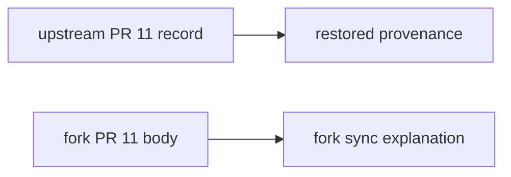

# Restore colliding upstream update provenance

## Intent of the change

- Restore upstream `docs/updates/11.md` byte for byte.
- Correct fork PR 11's update-number collision without changing runtime code.
- Preserve fork-sync explanation in GitHub PR 11 rather than an upstream-owned path.

## Architecture changes

- No architecture, product, provider, API, state, or deployment change.
- Numbered update paths belong to the source repository's PR history; a fork must not overwrite an imported upstream record when PR numbers collide.

## Summarized package changes

- Restores one documentation file from upstream main.
- Adds this non-colliding fork correction record.
- No package source, generated contract, dependency, or configuration change.

## Critical to apply to forks

no — documentation provenance correction only. No deployment or migration action.
