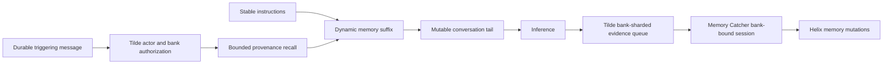

# Intent of the change

- Make durable memory an owner-selectable part of ordinary OpenBot conversations
  while keeping both OpenBot and the reusable Tilde SDK default-off.
- Give opted-in ordinary bots a bounded, provenance-bearing recall projection
  before inference and provision an owned bank only for `personal_plus_agent`.
- Deploy Memory Catcher as an ordinary user-owned background agent with a
  stable, least-privilege synthesis surface.
- Render Memory Catcher's inference adapter from the installation's selected
  provider, preserving Codex subscription, direct Gateway, and managed OIDC auth.
- Let owners use the public SDK to inspect, edit, and delete explicit personal
  facts, and to pause or assign personal-bank background synthesis.

# Architecture changes

- Tilde remains the authorization, storage, queue, embedding, retrieval, and
  synthesis-session authority. OpenBot does not accept a model-supplied bank,
  organization, team, or user identifier during automatic recall or synthesis.
- The Agent Provider reconciles the installation or per-agent selected memory
  mode. Only `personal_plus_agent` provisions a bot-owned bank. Memory Catcher
  reconciles first when memory is enabled, with automatic memory disabled and no
  bank of its own, so dependent bank creation cannot race or recurse. The bank
  bundle declaratively assigns `memory-catcher` and converges assignment drift.
- Stable authored instructions stay at the provider-cache prefix. A bounded
  untrusted-data projection follows them before the mutable conversation tail.
- The synthesis runtime exposes only session-bound recall, retain, supersede,
  forget, and completion operations plus read-only skill discovery.
  Communication, unbound memory, control-plane mutation, and batch-wrapper
  tools are excluded.
- Every mutation and finish receipt carries the current job's exact batch ID,
  complete evidence IDs, and fresh lease owner. Delete uses Tilde's durable
  per-operation receipt so exact retries do not repeat an applied provider
  mutation, and stale claims cannot adopt an earlier worker's completion.

# Summarized package changes

- `@trytilde/api-client`: refresh the generated contract from the merged Tilde
  Memory and organization AI-credit API surface.
- `@trytilde/sdk`: add stable camel-case clients for team, visible, and personal
  banks; owner-managed documents; source bindings; personal synthesizer
  assignment; synthesis sessions; and ChatKit automatic-memory settings/recall.
- `@trytilde/sdk-vercel-ai-node`: add the automatic-memory projection controller,
  request-bound lease-fenced synthesis tools, idempotent background forget,
  and a strict synthesis tool allowlist.
- `@tryopenbot/agent-provider`: reconcile agent-owned banks and automatic-memory
  modes from durable fork settings, default off, without giving Memory Catcher
  recursive memory.
- `openbot`: scaffold Memory Catcher, its managed synthesis skills, required
  discoverable source files, selected-provider inference adapter, deterministic
  dependency-first deployment when memory is enabled, and automatic recall in
  future Factory templates.
- Documentation: record the opt-in SDK/default OpenBot policy in ADR-0034 and
  document the SDK, provider, agent, security, and caching behavior.
- Validation at the final API #235 contract: 95 core SDK tests, 125 Vercel
  adapter tests, 15 Agent Provider tests, 19 Agent Service Provider tests, 175
  CLI tests, and generated SDK validation for 660 operations and all ten SDK packages. The
  complete repository `pnpm check` and `pnpm build` gates also pass; remaining
  lint warnings are pre-existing in files outside this change.
- Local thread evidence was limited to the current coordinated implementation
  task and its parent status messages because no supported read-only interface
  for enumerating every unrelated local task was available. No private raw
  transcript, credential, or unrelated planning was copied here.

# Critical to apply to forks

yes — deploy Tilde API #228 and #235 first, update generated SDK packages,
then rerun initialization or explicitly materialize the Memory Catcher agent and
the changed future-agent template. A customized fork must keep its authored
agent edits, add Memory Catcher with its two synthesis skills and restricted
tool surface, reconcile it before ordinary bots, and deploy ordinary bots with
their intended automatic-memory mode. Persist
`OPENBOT_AUTOMATIC_MEMORY_MODE` (default `none`) or a per-agent
`AGENT_<ID>_AUTOMATIC_MEMORY_MODE` override in fork environment configuration.
Its mutation calls must pass the exact batch, complete evidence set, and lease
owner from the current job. No new secret is introduced. Existing fork-owned agents
are not rewritten automatically and must be migrated and exercised through
lease recovery, background synthesis/forget, foreground recall, explicit-fact
editing, and deletion before production rollout.
