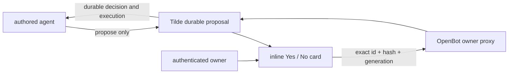

# Intent of the change

Give an authored agent a safe way to ask for a missing capability without giving
the model authority to approve or execute its own request. The owner reviews the
server-authored impact inside the active conversation and answers with an exact
Yes or No action. Free-text confirmation is never interpreted as approval.

# Architecture changes

The Tilde API remains authoritative for proposal state, the linked Human
Approval, durable execution, receipts, provider setup continuation, and rollback.
OpenBot adds a propose-only agent tool, a stable SDK projection, an
owner-authenticated same-origin decision proxy, and a shared conversation card.

The control service uses only the owner bearer already verified by its auth
middleware. It does not substitute the installation API key. The card contains
no credential values or approval token, and generic provider setup remains
server-authored.

# Summarized package changes

- `@trytilde/sdk` adds `SelfExtensionClient` and camel-case proposal, preview,
  approval, resource, and provider-continuation types.
- `@tryopenbot/client-runtime` validates supported proposal-tool output and
  strips fields outside its tokenless projection, requires the nested approval
  to bind the same proposal identifier, submits the exact decision binding, and
  reloads durable status so a completed card cannot become pending again after
  navigation or restart.
- `@tryopenbot/ui` renders the proposal impact and Yes/No decision as a distinct
  conversation block rather than a collapsed tool row.
- The browser and Electron renderer resume the conversation only after the
  authenticated decision succeeds, with generic errors that do not expose
  provider details.
- The control service adds an owner-only decision proxy and returns only the
  explicit approval projection rather than forwarding a successful upstream
  proposal body verbatim.
- Upstream lookup and decision failures are replaced with generic client errors;
  provider details and secret-shaped failures are never forwarded to the owner UI.
- Approval cards keep the latest reload callback without retriggering the durable
  lookup merely because a renderer recreated that callback.
- Future authored agents receive `propose_self_extension` and explicit prompt
  rules that forbid free-text approval and credentials in chat.
- ADR-0037 records inline-only, propose-only self-extension ownership.

# Critical to apply to forks

yes

Forks must regenerate or migrate their materialized authored agents so they
receive `tools/propose_self_extension.ts` and the matching prompt rules. They
must retain the owner-authenticated capability-decision route in their control
service and carry the shared card through their active browser/Electron renderer.
Forks must not expose `approve`, `reject`, execution, output-claim, or rollback
SDK actions as model tools. Existing generic provider setup UI remains the only
place to continue OAuth or credential collection.
