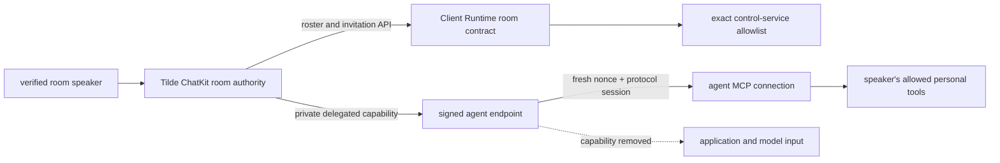

# Intent of the change

Retain the safe programmatic foundation for multiplayer ChatKit rooms while
keeping unfinished raw-user-ID owner controls out of the product. Add opt-in
speaker-bound personal tool federation so one shared agent can use only the
verified current speaker's personal tools without placing their identity or
credential capability in model-visible data or portable configuration.

# Architecture changes

Tilde remains the authority for room membership, invitations, roles, event
audiences, verified speakers, and delegated personal-tool capabilities. OpenBot
adds stable SDK wrappers, a dormant Client Runtime contract, an exact
same-origin allowlist, and request-scoped private MCP header forwarding.

Owner-facing room UI remains deferred by ADR-0036 until human identity
discovery can replace raw Tilde user identifiers. Web and Electron share the
dormant framework-neutral contract; Expo remains paused on main.

# Summarized package changes

- `@trytilde/sdk` adds `ChatKitRoomsClient`, room/participant/invitation types,
  create/roster/add/leave/invite/decide/revoke operations, and bounded
  deterministic group-turn orchestration.
- `@tryopenbot/client-runtime` adds strict room schemas and same-origin methods
  for roster, invitations, decisions, revocation, and departure.
- `@tryopenbot/control-service` allows only the room paths and HTTP methods
  consumed by Client Runtime.
- `@tryopenbot/agent-provider` reconciles the default-off
  `OPENBOT_PERSONAL_TOOL_FEDERATION_MODE` into each agent MCP server.
- `@trytilde/sdk-vercel-ai-node` privately forwards a verified delegated
  speaker capability with fresh nonce/protocol-session bindings and strips the
  delivery header before application code runs.
- `openbot` future-agent templates construct every managed MCP connection from
  `context.mcp.connect(...)`, so the verified request capability reaches the
  default `agentLoop` path rather than only tool-mode endpoints.
- Generated Tilde clients come from merged API #227's exact OpenAPI document.
- ADR-0036 and package documentation record ownership, security, and UI
  deferral decisions; three Changesets cover the published behavior.

# Critical to apply to forks

yes

Forks that want personal tool federation must explicitly set
`OPENBOT_PERSONAL_TOOL_FEDERATION_MODE` to `selected` or `all`; leaving it unset
preserves `none`. They must keep signed ChatKit endpoint handling in front of
request-scoped MCP construction so the delegated capability remains private
and is stripped before agent/application code runs. Forks exposing room APIs
through their control service must retain the exact roster/invitation method
allowlist. Do not revive owner room UI with raw Tilde user-ID entry; wait for or
implement human identity discovery and prove client parity first.
