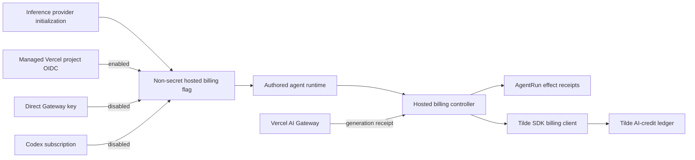

# Intent of the change

Give hosted OpenBot inference safe, exact billing without coupling billing to
provider initialization. Agents reserve organization AI credits before every
managed model call, persist invocation intent and Gateway generation identity
through the AgentRun effect ledger, then commit the authoritative receipt or
release excluded/failed calls. Only Tilde-managed Vercel project OIDC is
billable. Direct owner Gateway keys, Gateway BYOK generations, and Codex
subscription calls stay outside this meter.

# Architecture changes

Tilde remains the billing and authorization boundary. OpenBot stores no billing
ledger or receipt Control State. Inference providers only reconcile one
non-secret environment marker and contribute fork-owned template source. They
do not gain request-time model factories or billing methods. Request-time
reservation, exact settlement, BYOK exclusion, and uncertain-outcome recovery
belong to `@trytilde/sdk-vercel-ai-node` and the authored agent. Both provider
templates accept an optional model ID so durable jobs can bind their selected
model without changing provider ownership.
ADR 0004 is amended to preserve that split explicitly.

# Summarized package changes

- `@trytilde/sdk`: adds `BillingClient`, `AiCreditsClient`, reservation and
  context types, exact receipt commit input, client composition, focused request
  mapping tests, and Public API documentation. AgentRun effect prepare/finish
  now send the API-required generation, worker ID, and planned/terminal status.
- `@tryopenbot/inference-provider`: writes
  `OPENBOT_HOSTED_INFERENCE_BILLING=1` only for managed Vercel project OIDC,
  resets it to `0` for direct-key Vercel and Codex subscription inference,
  accepts optional per-call model IDs in provider-owned templates, and covers
  the selection rules with provider tests.
- `@trytilde/sdk-vercel-ai-node`: adds a hosted billing controller that reserves
  before inference, captures Gateway generation IDs from callbacks/chunks,
  settles exact receipts, releases BYOK/provider-failed reservations, and
  refuses provider replay for planned, uncertain, or committed effects. Every
  Gateway call reserves first; an authoritative BYOK receipt releases it.
- `openbot`: wires the controller into the generated agent webhook, returns a
  clear 402 for exhausted credits, keeps reconciliation fail-closed, reports
  authoritative hosted cost to AgentRuns, and closes MCP resources on every
  preflight, stream, abort, and synchronous failure path.
  A reconciled or uncertain provider call without a recoverable response marks
  the current run failed, so a later owner request starts a new run explicitly.
- `@tryopenbot/platform-integrations`: forwards the non-secret hosted billing
  marker through the narrow Tilde Cloud runtime allowlist while continuing to
  exclude Vercel tokens and other control-plane secrets.
- `.changeset/add-hosted-inference-metering.md`: requests minor releases for
  the five changed public packages.
- No client renderer, protobuf, credential destination, external dependency,
  or tracked upstream `configuration/` content changes.

# Critical to apply to forks

yes — rerun `openbot init` after merging so the selected inference provider
reconciles `OPENBOT_HOSTED_INFERENCE_BILLING` in fork-owned configuration.
Tilde Cloud hosted releases forward that marker automatically; customized
release adapters must preserve it without broadening their secret allowlists.
Customized inference templates should adopt the optional third `modelId`
argument and compose `HostedInferenceBillingController` with their AgentRun
effect store before enabling the flag. Do not enable hosted billing manually for
direct owner Gateway keys, BYOK generations, or Codex subscription calls. Forks
must preserve the fail-closed reconciliation response: a planned, uncertain, or
committed effect must never cause the provider request to be repeated. Gateway
BYOK does not bypass the reserve gate: Vercel can fall back to charged system
credentials, so zero-credit organizations cannot start any Gateway call. The
authoritative BYOK receipt releases a successful reservation.
After billing/effect reconciliation without a recoverable response, customized
agents must terminally fail the current run rather than leave it in an automatic
waiting/resume loop.
Non-hosted jobs with `max_cost_microusd` must retain manual input/output price
rates. Hosted jobs use authoritative receipt cost. AgentRun cost budgets are
post-call guards and can overshoot by the final call, while organization credit
reservation remains a pre-call gate.
