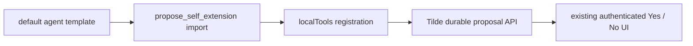

# Intent of the change

Make the existing secure self-extension proposal workflow actually callable by
default authored agents. The propose-only tool was scaffolded as a file but was
not imported or registered in the default agent's runtime tool set.

# Architecture changes

No boundary changes. The default authored agent now connects the already-owned
tool file to its existing local tool set.

ADR-0037's propose-only authority remains intact: the agent cannot approve,
execute, claim outputs, roll back, or collect credentials through this tool.

# Summarized package changes

- `openbot` imports and registers `propose_self_extension` in the default agent
  template under its exact wire name.
- Scaffold tests prove rendered agents contain the import and registration, and
  that the rendered tool calls `client.selfExtension.propose` with the
  path-derived agent ID.
- A patch Changeset records the corrected default behavior.

# Critical to apply to forks

yes

Forks with materialized agent templates or existing authored agents must add
the same `propose_self_extension` import and `localTools` registration to each
agent that should expose the approved self-extension workflow. Adding only the
tool file is insufficient. Keep approval, execution, output claim, rollback,
and credential handling outside model-visible tools.
