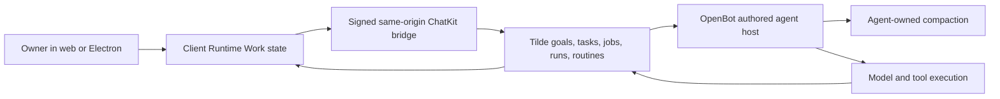

# Durable agent work and execution

## Intent of the change

OpenBot agents could answer one request and run a bounded in-memory tool loop, but substantial work had no cohesive durable product. Goals and tasks were not available through the public SDK or default tools, delegated children lacked a complete owner surface, long conversations had no agent-owned compaction checkpoint, and model continuation could not survive an invocation boundary safely.

Add one end-to-end durable-work slice. Keep Tilde authoritative for persisted work and OpenBot authoritative for authored model behavior, tools, host policy, and presentation.

## Architecture changes

Four accepted boundaries now ship together:

- ADR-0032 binds goals, tasks, and background jobs to one agent and ChatKit session.
- ADR-0033 keeps model-context compaction in authored agent code while Tilde stores lifecycle evidence and the canonical transcript.
- ADR-0034 gives Tilde durable child-job state while OpenBot owns delegation policy and provider execution.
- ADR-0035 gives Tilde runs, leases, accounting, and effect receipts while OpenBot owns continuation and loop policy.

Client Runtime owns the remote Work snapshot and polling lifecycle. The shared UI package renders it for the web application and packaged Electron client. Renderer-local duplicated network state was deliberately removed during extraction.

The runtime consumes only signed server-authored `tildeAgentRun` and `tildeAgentJob` metadata. API #229 was merged first to forward persisted model and hard-budget values without trusting caller headers.

## Summarized package changes

- `openbot`: scaffold goal, task, child-job, and routine tools; wire durable runs, trusted job context, and context compaction into generated agents.
- `@trytilde/sdk`: add typed work, job, routine, run, effect-receipt, and compaction clients.
- `@trytilde/sdk-vercel-ai-node`: add the durable run controller, uncertain-effect guard, compaction controller, composed `prepareStep`, and compacted-history session support.
- `@tryopenbot/inference-provider`: allow an explicitly selected child-job model while preserving configured defaults.
- `@tryopenbot/client-runtime`: validate and own Work snapshots, polling, and job-control actions.
- `@tryopenbot/ui`: add the tested Work overview and background-job detail/control surface.
- `@tryopenbot/web`: replace the routines-only details route with the combined Work pane.
- Generated API client: refresh from the merged Tilde contract through API #229 and validate 663 operations.
- Documentation: add ADRs 0032-0035, update ADR-0011, product language, agent guidance, and affected package READMEs.
- Release notes: add five focused Changesets for the independently published surfaces.

Validation passed for core SDK (86 tests), Vercel AI adapter (106), Client Runtime (104), UI (72), CLI/scaffolding (170 across 33 files), inference provider (12), SDK validation, full repository check, and full repository build/package verification. Browser/e2e automation was not run because it was not explicitly requested.

## Critical to apply to forks

yes

Forks with customized agents must port the new generated-agent tools and runtime wiring manually; OpenBot never overwrites existing fork-owned agent files. Regenerate or reconcile from the updated future-agent template, preserve the fixed agent ID and session binding, and deploy API #229 or later before the OpenBot update so signed child model/budget metadata is available.

No database, secret, credential, environment-name, or state-import migration is required. The new optional environment values have safe defaults for run duration/steps, context-window size, and model cost rates. A cost-capped child job fails closed when pricing is unavailable.

Complete local coding-agent thread enumeration was unavailable in this execution context. This record uses the preserved integration workspace, full isolated diff, accepted ADRs, merged API dependency, focused validation, and current task evidence without claiming unrelated thread coverage.
