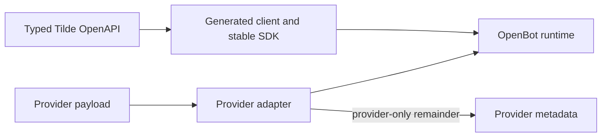

# Intent of the change

Prevent OpenBot metadata from becoming an internal Tilde/OpenBot control protocol. Provider-specific extensions remain available, while internal execution, identity, routing, lifecycle, memory, and presentation fields must use typed contracts.

# Architecture changes

ADR 0038 aligns OpenBot with Tilde API ADR 0022. `AGENTS.md` and the PR, pre-commit, API exposure, SDK wrapper, and provider implementation skills now block magic metadata protocols. The audit identifies current template, Signal, UI, credential, and provider catalogue debt.

# Summarized package changes

No package implementation changes. Contributor guidance requires metadata classification and directs missing Tilde fields upstream instead of adding hand-authored parsers. No Changeset is needed for documentation-only internal guidance.

# Critical to apply to forks

yes — forks should take the updated `AGENTS.md`, skills, and ADR during their next upstream convergence so fork-authored agents and providers do not add new internal metadata protocols. No runtime configuration, secret, state, dependency, or deployment change is required.
