# Intent of the change

Memory Catcher synthesis used the installation's selected inference provider,
but the custom synthesis endpoint did not compose the hosted-inference billing
controller shipped for ordinary Factory turns. Managed Vercel project-OIDC
synthesis could therefore call AI Gateway without reserving or settling Tilde
AI credits.

This change puts each exact synthesis batch and API worker lease behind a
durable AgentRun. The endpoint asks Tilde to validate the exact batch digest,
complete evidence set, current unexpired lease, bound synthesis session, and
assigned synthesizer before any billing action, reserves managed Gateway credits,
persists effect intent before the provider starts, settles authoritative
Gateway receipts, and completes the run only after a successful
`finish_synthesis` result and exact completion marker.

The validation contract was merged first in Tilde API #239 as
`312e0c32e0a8110eb4404a388087f27a45d26d84`. It accepts only the deterministic
current oldest-first prompt chunk under the active lease; arbitrary or later
same-lease subsets remain invalid until the earlier chunk completes.

# Architecture changes

```mermaid
flowchart LR
  W[Tilde synthesis worker] --> P[Signed batch prompt]
  P --> V[Validate exact current batch lease]
  V --> R[Batch plus lease AgentRun]
  R --> E[Stable semantic effect scope]
  E --> C[Current generation and worker fenced write]
  C --> G[Gateway model call]
  G --> S[Authoritative generation settlement]
  S --> F[Successful finish_synthesis]
  F --> D[Terminal completed run]
```

The hosted billing controller now separates semantic effect identity from the
generation-derived AgentRun step ID. `effectScope` stays stable when a worker
reclaims the same continuation under a newer run generation, so lookup finds
the old planned or committed effect before reservation or provider execution.
Prepare and finish writes still send the current run generation, worker, and
step, preserving API fencing. Factory uses its semantic continuation number;
Memory Catcher uses its exact synthesis batch and API lease.

A completed redelivery is acknowledged without reopening inference. Failed
credit commit or BYOK release remains waiting until preflight replays the
committed settlement. A prior
planned, uncertain, or settled provider outcome with no recoverable model
response remains terminal and cannot be replayed. A newly reclaimed API
synthesis lease receives its own run because API mutation and completion
receipts are also bound to that fresh lease.

# Summarized package changes

- `@trytilde/sdk-vercel-ai-node`: add
  `createMemorySynthesisInferenceRun`, exact synthesis invocation parsing,
  exact current-batch validation, completion-result validation, and stable
  `effectScope` support in `HostedInferenceBillingController`.
- `@trytilde/sdk`: add the hand-authored
  `MemorySynthesisSessionClient.validateBatch` wrapper for Tilde's exact
  batch/lease/evidence validation endpoint.
- `openbot`: compose the helper in the materialized Memory Catcher endpoint;
  reserve all managed Gateway calls, release authoritative BYOK receipts,
  commit authoritative system/fallback receipts, pause on insufficient credits,
  and fail closed for unsafe reconciliation. Factory now supplies a semantic
  continuation effect scope that survives run-generation reclaim.
- Tests: cover managed reservation/commit, BYOK release and failed release
  recovery, failed credit-commit recovery, insufficient credits, spoofed lease
  rejection before run/reservation, direct/Codex exclusion, failed completion,
  same-lease redelivery, fresh-lease identity, and planned/committed recovery
  when the AgentRun generation advances from N to N+1.
- Documentation: amend the automatic-memory and durable-run ADRs, update the
  SDK public API contract, refresh the exact merged OpenAPI operation
  `validateSynthesisSessionBatch`, and add a Changeset for the published behavior.

# Critical to apply to forks

yes

Forks with materialized agents must merge this update and migrate both kinds of
authored endpoint:

- Every ordinary Factory-derived agent that constructs
  `HostedInferenceBillingController` must pass a semantic `effectScope` based
  on the logical continuation, not `runGeneration` or `stepId`.
- The materialized `memory-catcher/agent.ts` must use
  `createMemorySynthesisInferenceRun`, validate its exact current batch and
  lease, attach all AI SDK model-call callbacks, and preserve the strict
  synthesis tool allowlist.
- Keep provider selection inherited from the installation. Managed Vercel
  project OIDC enables hosted billing; direct owner Gateway keys and Codex
  subscription inference remain outside Tilde metering.
- Do not copy credentials or fork configuration from upstream. Existing
  `OPENBOT_HOSTED_INFERENCE_BILLING` and reserve-size environment behavior is
  reused; no new environment name or secret is introduced.

After adapting materialized templates, run the SDK hosted-billing and synthesis
tests, the agent scaffold tests, `pnpm check`, and `pnpm build`. The local task
audit covered the complete collaborative task tree exposed to this coding
agent; unrelated private Codex tasks were not available and are not represented
in this record.
