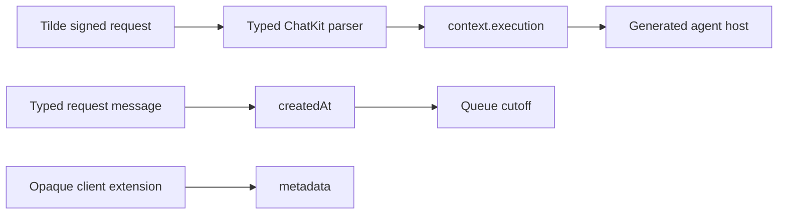

# Intent of the change

Stop interpreting Tilde-owned AgentRun, delegated-job, and request-ordering state from arbitrary ChatKit message metadata. The Vercel AI SDK adapter validates a typed execution context, exposes it directly to handlers, and the generated agent uses that trusted contract.

# Architecture changes

ADR 0038 governs the boundary. The SDK validates the discriminated `agent_run` and `agent_job` variants and rejects malformed generations or budgets. Agent templates no longer scan message metadata for internal execution objects or timestamps.

# Summarized package changes

- `@trytilde/sdk-vercel-ai-node`: adds typed execution contracts, validation, endpoint context, and request timestamps.
- `openbot`: consumes `context.execution` and typed message timestamps in the generated Factory agent.
- Focused parser tests cover valid delegated-job state, absence from message metadata, and invalid generations.

# Critical to apply to forks

yes — regenerate or update materialized Factory agents after the matching Tilde API contract is deployed. Ordinary requests without durable execution context remain backward compatible.
