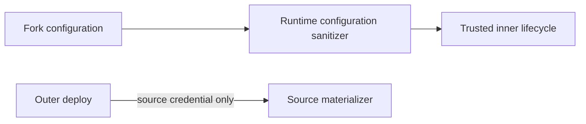

# Intent of the change

Keep outer-deployment Code Storage values out of the fork configuration copied into a trusted runtime.

# Architecture changes

The outer deployment retains its one-shot source credential. Both the systemd environment and copied `configuration/.env` inside the runtime omit Code Storage values.

# Summarized package changes

- `@tryopenbot/agent-service-provider`: sanitize copied configuration lines beginning with `CODE_STORAGE_`.
- Tests: preserve ordinary configuration while removing both plain and exported Code Storage entries.
- Changesets: patch the fixed OpenBot package group.

# Critical to apply to forks

yes — trusted-runtime forks should update and redeploy after PR #132. This prevents Computer bootstrap from seeing outer source credentials and resetting the materialized checkout. No credential rotation, state migration, or user configuration change is required.
