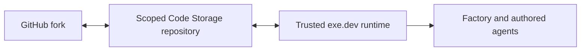

# Intent of the change

Keep Code Storage authoritative inside trusted exe.dev runtimes and undo the temporary local-Git fallback.

# Architecture changes

The runtime continues to receive only a repository-scoped token. The organization key remains transient during initial creation or rename migration.

# Summarized package changes

- Revert the runtime environment/configuration filtering introduced by PRs #132 and #133.
- Restore Code Storage reconciliation inside the watched runtime.
- Add a fixed-group patch changeset for downstream forks.

# Critical to apply to forks

yes — forks that adopted PRs #132/#133 should update, ensure their renamed Code Storage repository is linked to the current GitHub fork, rotate the repository-only token, and redeploy. Do not switch trusted exe.dev runtimes to sandbox-local Git.
