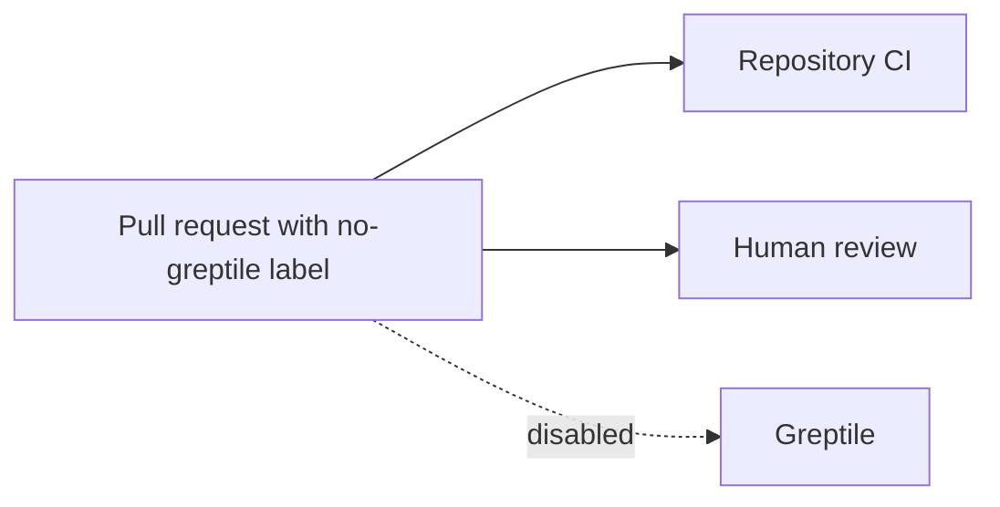

# Intent of the change

Disable automatic Greptile reviews and prevent future agents from triggering or waiting for external review bots.

# Architecture changes

The repository-local Greptile policy disables labeled PRs, update triggers, and status checks. PR tooling now applies the disabling label at creation time.

# Summarized package changes

- Add `.greptile/config.json` with the `no-greptile` disabled label and update/status automation off.
- Require the label in `AGENTS.md`, the PR skill, and the pull-request template.
- No runtime or published package changes.

# Critical to apply to forks

yes — forks should create the `no-greptile` repository label and sync these policy files so every new PR is excluded from automatic external review.
