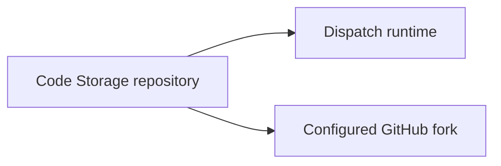

# Intent of the change

README said managed Tilde Cloud runtime used local Git. That text was stale.
Managed runtime already uses Code Storage as authoritative repository and syncs
configured GitHub fork.

# Architecture changes

No code or architecture change. Documentation now names existing boundary.

# Summarized package changes

- Root README: replace stale `LocalGitProvider` statement with current
  `CodeStorageGitProvider` behavior. Use Dispatch product name.

# Critical to apply to forks

no — documentation-only correction. Forks already configured with Code Storage
need no code, configuration, secret, or deployment change.
