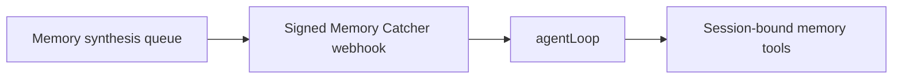

# Intent of the change

Memory Catcher handles private background synthesis. It has no human active
turn and never sends a conversational reply. Tool response mode incorrectly
required participant-routing headers and rejected valid synthesis webhooks.

# Architecture changes

Memory Catcher now uses the direct background agent loop while retaining its
strict memory-only tool allowlist.

# Summarized package changes

- `openbot` scaffold: generate Memory Catcher with `responseMode: "agentLoop"`.
- `openbot` tests: assert the background mode and forbid conversational tool
  mode in the generated catcher.

# Critical to apply to forks

yes — regenerate or update the fork's tracked Memory Catcher `agent.ts` so its
endpoint uses `responseMode: "agentLoop"`, then redeploy the agent runtime.
No secret, environment, API, or database migration is required.
