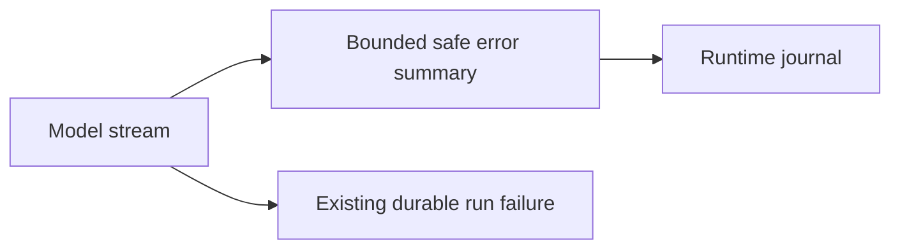

# Intent of the change

Memory Catcher stream failures occurred after the HTTP response began, leaving
only a generic upstream error. Emit a bounded diagnostic without request data.

# Architecture changes

No boundary changes. The existing inference callback now reports the error
class and at most 500 characters of its message before durable failure handling.

# Summarized package changes

- `openbot` Memory Catcher scaffold: log safe inference stream diagnostics.

# Critical to apply to forks

yes — update the tracked Memory Catcher scaffold and redeploy if operators need
the diagnostic. No configuration, secret, API, or database migration is needed.
