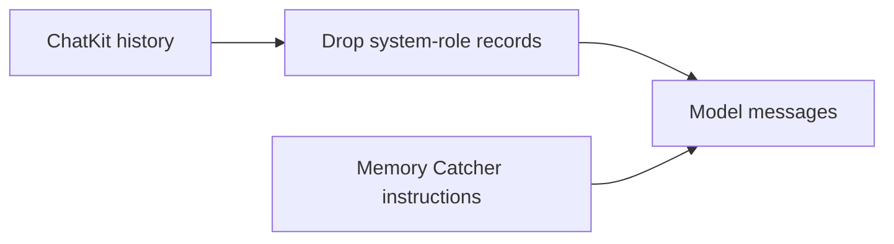

# Intent of the change

Memory Catcher supplies its system prompt through the AI SDK instructions field.
Historic ChatKit system records duplicated that prompt in model messages and
caused AI SDK to reject the inference request.

# Architecture changes

The Memory Catcher boundary now drops system-role history before model
conversion. User, assistant, and tool history remain unchanged.

# Summarized package changes

- `openbot` scaffold: filter system history before Memory Catcher inference.
- `openbot` tests: require the filter in generated agents.

# Critical to apply to forks

yes — update the tracked Memory Catcher agent and redeploy. No configuration,
secret, API, or database migration is required.
