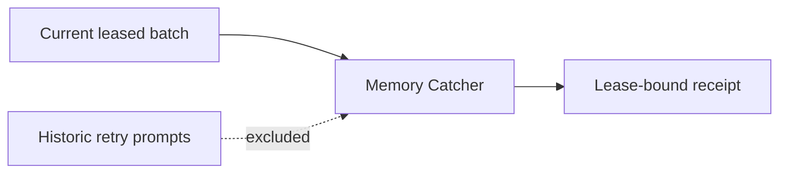

# Intent of the change

Memory synthesis retries shared one long ChatKit session. Sending all historic
prompts to the model exposed obsolete lease owners, so the model selected stale
bindings and every mutation was rejected.

# Architecture changes

Each Memory Catcher inference now receives only the current signed webhook
batch. Durable memory state remains in the bank and receipts, not prompt history.

# Summarized package changes

- `openbot` scaffold: remove full synthesis-session history from model context.
- `openbot` tests: require current-batch-only input.

# Critical to apply to forks

yes — update the tracked Memory Catcher agent and redeploy it. No secret,
environment, API, or database migration is required.
