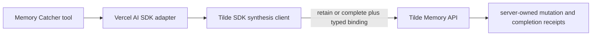

# Intent of the change

Tilde's production memory API accepts typed synthesis commands. Dispatch's
hand-authored SDK still sent the older document-only shape, encoded the batch
and lease inside metadata, and represented completion as a fake memory
document. The API rejected those requests before authorization with HTTP 422,
so Memory Catcher could recall evidence but could not retain memory or finish a
batch.

This change makes the SDK send the deployed contract exactly. It also removes
stale canonical text that described memory as requiring a separate paid
entitlement.

# Architecture changes

No ownership boundary changes. The existing SDK and adapter boundaries now use
the already-accepted typed Memory contract instead of a metadata protocol.

- `MemoryDocument` fields such as type, title, importance, relations, and tags
  are serialized at their typed wire locations.
- A synthesis retain carries `operation: retain`, its document, and an exact
  batch/evidence/lease binding.
- Completion carries `operation: complete`; no synthetic receipt document is
  created.
- Synthesis deletion nests the same binding beside the document ID.
- Caller metadata remains an opaque extension on ordinary SDK document input.
  Synthesis tools neither accept nor interpret it.

# Summarized package changes

- `@trytilde/sdk`
  - Add exported synthesis binding and upsert input types.
  - Require the active batch, complete evidence set, and lease owner for every
    synthesis upsert.
  - Serialize document relationships as typed relations instead of metadata.
  - Send typed retain, complete, and delete commands.
  - Validate optional importance before issuing a request.
- `@trytilde/sdk-vercel-ai-node`
  - Pass synthesis bindings explicitly from Memory Catcher tools.
  - Remove lifecycle metadata injection and the model-facing arbitrary metadata
    field.
- Tests prove all three mutation shapes, typed document encoding, absence of
  internal lifecycle metadata, tool binding propagation, and input validation.
- ADR and historical release text no longer present a separate paid memory
  entitlement as current product behavior.

Validation completed with both affected package suites (96 SDK tests and 143
Vercel adapter tests), both affected package type checks, repository
`pnpm check`, and repository `pnpm build`.

# Critical to apply to forks

yes

Forks running automatic memory must merge this change before deploying against
the typed Tilde synthesis API. A customized Memory Catcher that calls
`MemorySynthesisSessionClient.upsert` must move the document under `document`
and pass `batchId`, `evidenceIds`, and `leaseOwner` beside it. Fork code must not
restore batch, lease, evidence relationships, or completion receipts in
metadata.

After merging, run the affected SDK and Vercel adapter tests and deploy the
agent service. Initialized forks should separately update their fork-owned
memory skill copies so they no longer claim that memory uses a retired provider
or carries a per-bank subscription.
