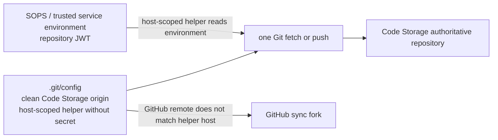

# Intent of the change

Code Storage stays source of truth. Secret stays managed. Secret no longer sits inside `origin` URL.

Before change, Code Storage repository JWT lived in `.git/config` as part of authenticated remote URL. Long life made unattended work easy. Also made ordinary remote inspection reveal credential.

After change, remote URL contains organization and repository only. Git gets repository JWT from the managed process environment while it asks for a credential. Checkout stores helper command, not bearer value. Helper is scoped to exact Code Storage host. It does not answer GitHub remote requests.

Existing checkout needs no manual migration. Next Git Provider, trusted Computer, or exe.dev reconciliation replaces authenticated `origin` with clean URL. Repository-only JWT remains in SOPS and the trusted exe.dev mode-`0600` service environment. Organization signing key remains setup-only.

# Architecture changes

Credential boundary becomes narrower:

- persisted secret state: repository JWT in existing SOPS/service environment;
- persisted repository control state: clean `origin` and host-scoped helper text;
- runtime secret state: JWT remains in the managed process environment and is resolved only when Git authenticates;
- unchanged external state: Code Storage repository, GitHub synchronization, branch, and no-force-push policy.

No public HTTP, ConnectRPC, OpenAPI, protobuf, client, or metadata contract changed. No local-git fallback added. Code Storage remains authoritative.

# Summarized package changes

- `@tryopenbot/git-provider`
  - sanitizes legacy credential-bearing Code Storage remotes;
  - configures a Code Storage-host-scoped helper that reads `CODE_STORAGE_REPOSITORY_TOKEN` at execution time;
  - passes token through child environment for lifecycle push instead of command arguments or remote URL;
  - strips credentials before preserving an old origin as `upstream`;
  - adds regressions proving neither current nor legacy JWT enters Git arguments.
- `@tryopenbot/agent-service-provider`
  - renders a clean exe.dev source URL;
  - loads only the repository JWT needed for initial reconciliation from the private environment file;
  - authenticates initial clone/fetch with a transient reconciliation copy, then unsets that copy;
  - installs the non-secret host-scoped helper for later supervised background reconciliation.
- `@tryopenbot/computer-service-provider`
  - uses the same clean remote and helper boundary when preparing the trusted development checkout.
- Documentation
  - updates provider guidance and the Git Provider package README;
  - amends ADR 0020 and ADR 0032 with the credential-lifetime decision;
  - adds a patch changeset for the fixed OpenBot package group.

Proof completed on rebased PR head:

- Git Provider: 14 tests passed;
- Agent Service Provider: 19 tests passed;
- Computer Service Provider: 27 tests passed;
- focused package checks passed;
- full `pnpm check` passed with zero errors and existing unrelated warnings;
- full `pnpm build` passed;
- both changed shell templates passed syntax checks;
- direct Git credential-helper probe returned the environment credential while keeping it out of remote configuration.

Local coding-agent database review covered all 96 available tasks and found 19 containing Code Storage, repository-token, or Git-config evidence. Relevant history confirmed Code Storage authority, the exe.dev unattended lifecycle, the fork rename, and the prior authenticated-origin persistence. No unrelated private task material is included here.

# Critical to apply to forks

yes

Forks using `CodeStorageGitProvider`, exe.dev, or the trusted development Computer should merge this update and run one normal deployment/reconciliation. That run sanitizes any existing authenticated `origin`, installs the host-scoped non-secret helper, and leaves Code Storage authoritative.

Keep `CODE_STORAGE_REPOSITORY_TOKEN` in the existing managed secret store and runtime environment. Do not put the token into `configuration/.env`, a remote URL, a global credential helper, or a replacement local-git remote. Confirm afterward that `git remote get-url origin` is `https://<organization>.code.storage/<repository>.git` with no user-info component and that an unattended reconciliation can still fetch and push.
