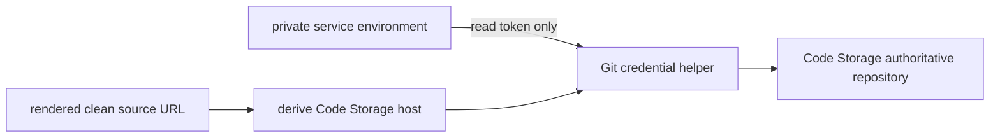

# Intent of the change

Restore exe.dev deployment after PR 144. Keep clean Code Storage remote. Keep host-scoped environment credential helper. Remove one accidental dependency on a shell variable that was intentionally not exported.

Failure happened after successful fetch. Script ran with `set -u`. Token-reading subshell exported only token to parent. Later line tried to read `CODE_STORAGE_ORGANIZATION` and Bash stopped as unbound.

Clean source URL already contains validated Code Storage host. Script now derives host from that URL. No extra secret or environment field needs to cross subshell boundary.

# Architecture changes

Architecture does not otherwise change. Remote remains credential-free. Token remains managed environment state. Helper remains scoped to Code Storage host. No local-git fallback, public contract, metadata field, or deployment topology changed.

# Summarized package changes

- `@tryopenbot/agent-service-provider`
  - derives helper host from `source_url` using shell parameter expansion;
  - validates derived host is non-empty;
  - removes the undeclared `CODE_STORAGE_ORGANIZATION` read;
  - adds a rendered-script regression for both facts.
- Release
  - adds patch changeset for fixed OpenBot package group.

Proof:

- 19 Agent Service Provider tests passed;
- Agent Service Provider focused check passed;
- rendered shell syntax passed;
- diff check passed.

Local coding-agent history was reviewed for the PR 144 credential change, the production deployment failure, and current hotfix. No unrelated task material is included.

# Critical to apply to forks

yes

Any fork that merged PR 144 and deploys through exe.dev must merge this fix before its next deployment. No configuration or secret migration is required. Run the normal deployment again; it will fetch the fork from credential-free Code Storage origin, configure the host-scoped helper, and continue past reconciliation.
