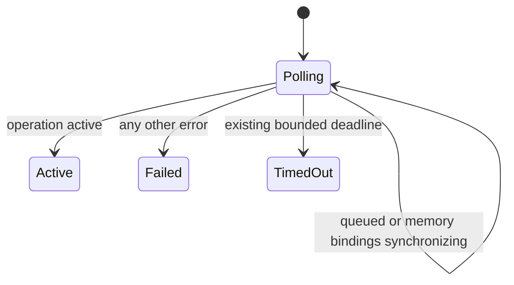

# Intent of the change

Stop healthy exe.dev startup from dying during one recoverable Tilde provisioning checkpoint.

Tilde Agent Resource Bundle worker can report `memory bindings are still synchronizing`, schedule retry, then make same operation active. Dispatch saw status `ERROR` and exited immediately. Runtime restart created same race again.

Dispatch now treats only that exact normalized message as pollable. Existing provisioning deadline remains bound. All other errors remain terminal immediately.

# Architecture changes

No ownership boundary changes. Tilde still owns durable provisioning and retry. Dispatch still polls authoritative operation. This changes only classification of one documented recoverable checkpoint.

No public API, metadata, secret, configuration, database, dependency, client, or deployment topology changed.

# Summarized package changes

- `@tryopenbot/agent-provider`
  - recognizes exact `memory bindings are still synchronizing` message after trimming and case normalization;
  - continues polling within existing 1,200-attempt, 500-millisecond interval;
  - keeps unknown, empty, and permanent errors on immediate failure path;
  - documents retry classification in package README.
- Tests
  - full provisioning regression begins with retryable `ERROR`, observes poll to `ACTIVE`, then completes credential and resource workflow;
  - existing permanent-error regression remains green.
- Release
  - patch changeset added for fixed OpenBot package group.

Proof: all 15 Agent Provider tests and focused package check passed. Diff check and configuration-ownership guard passed.

Local coding-agent history relevant to the Tilde provisioning worker retry, exe.dev startup failure, and preceding deployment repairs was reviewed. No unrelated private material is included.

# Critical to apply to forks

yes

Forks that provision automatic memory through Tilde should merge this fix before deployment. No configuration or data migration is required. Redeploy normally. Acceptance proof is that a temporary `memory bindings are still synchronizing` operation remains in the bounded poll loop and startup continues once Tilde marks it active, while a different operation error still stops deployment.
