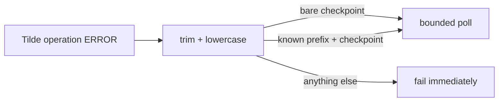

# Intent of the change

Match actual production error display from Tilde. PR 146 accepted bare `memory bindings are still synchronizing`. Production operation carried `service unavailable: memory bindings are still synchronizing`. Dispatch still stopped.

Accept exactly two normalized strings: bare checkpoint and checkpoint with known `service unavailable: ` CommonError display prefix. Do not use substring matching. Do not accept arbitrary service-unavailable errors. Keep existing bounded polling deadline.

# Architecture changes

No architecture boundary changed. Tilde owns operation and worker retry. Dispatch owns bounded polling and exact client-side classification.

# Summarized package changes

- Agent Provider matcher accepts bare checkpoint and exact production-prefixed checkpoint.
- Full provisioning regression first returns exact production string, then bare string, then active operation. This proves both accepted forms converge.
- Existing permanent-error regression continues proving unrelated failures are not hidden.
- Package README names the known prefix.
- Patch changeset included.

Proof: 15 Agent Provider tests passed, focused package check passed, diff and metadata guards passed.

# Critical to apply to forks

yes

Forks using Tilde automatic-memory provisioning must merge this after PR 146. No configuration or data migration. Redeploy normally. Do not claim deployment success until real operation traverses production-prefixed synchronization checkpoint and reaches active.
