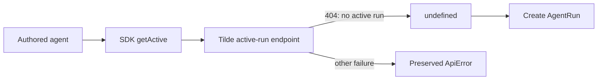

# Fix missing active AgentRun handling

## Intent of the change

New agent conversations have no active durable `AgentRun` yet. Tilde reports that expected absence as HTTP 404, but the TypeScript SDK previously propagated it as an exception. Every authored agent asks for the active run before creating one, so the exception made the agent endpoint return HTTP 500 before inference began.

Treat the missing active run as `undefined`, matching the SDK's public return type and allowing the agent to create the first run normally. Continue surfacing every non-404 failure.

## Architecture changes

The ownership boundary is unchanged. The hand-authored SDK now adapts the existing HTTP absence representation into its existing optional result.

## Summarized package changes

- `@trytilde/sdk`: make `AgentRunsClient.getActive` use the request layer's existing not-found allowance.
- `@trytilde/sdk` tests: prove the production-shaped 404 becomes `undefined` and a 503 still rejects.
- Changesets: publish the correction as a patch.

Validation covered the focused SDK suite and typecheck, the repository-wide check, and the full production build. The production HAR and exe.dev runtime logs provided the original failing trace.

## Critical to apply to forks

yes — forks whose authored agents use durable runs must sync this change and redeploy their agent runtime. Without it, a first message with no existing active run fails before model invocation. No configuration, secret, state, or API migration is required.
