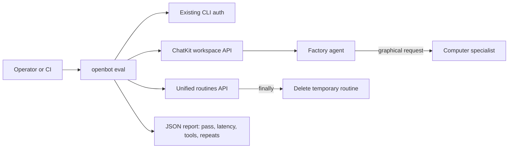

# Production evaluation command

## Intent of the change

- Problem: production quality proof lived in disposable scripts and chat notes. Hard compare. Easy forget. No stable pass/fail.
- Add `openbot eval`. One command. Same real Tilde workspace paths users exercise.
- Measure useful outcomes: completed answer, exact tool route, latency, duplicate tool calls, delegated Computer result, routine lifecycle.
- Keep secrets out. API key only environment. Otherwise cached `openbot auth` OAuth. Never secret CLI argument or report field.
- Keep mutation bounded. Routine test creates one temporary routine, updates it with version control, manually runs it, observes terminal state, deletes it. Cleanup failure fails evaluation.

## Architecture changes

- Ownership unchanged. CLI orchestrates. Tilde owns conversations, executions, and routines. Auth remains CLI/Tilde owned.
- No renderer state. No provider interface. No new service. No schema or protocol.
- Scenario contract:
  - `simple-answer`: answer must mention cookies, reject acknowledgement prefix, use only `sendMessage`.
  - `computer-delegation`: result must contain `Example Domain`; tools exactly delegate, wait, send.
  - `routine-lifecycle`: create, versioned update, run, observe `completed` or `succeeded`, delete.
- Repeat `--scenario` for subset. Default runs all three. `--json` emits one compact machine-readable object. Failed scenario sets non-zero exit.

## Summarized package changes

- `openbot` CLI:
  - new `eval` command and evaluator
  - API-key or cached OAuth authentication
  - defensive response parsing and bounded polling
  - exact tool and repeated-call metrics
  - cleanup-sensitive routine result
  - command/help/menu documentation
  - focused mock tests
- Workspace documentation:
  - root developer workflow lists `pnpm openbot eval --json`
  - CLI README documents scenarios, output, and secret handling
- Release:
  - fixed-group minor Changeset because command is new public CLI behavior
- Production proof before PR:
  - simple answer 5.07s, one tool, no repeats
  - delegated browser 29.09s, three expected tools, no repeats
  - routine lifecycle 5.49s, cleanup confirmed by 404
- Known boundary: authored-agent creation has no lifecycle-owned inverse. Evaluator does not create an agent until source, credentials, environment, and Tilde resources can all be deleted idempotently.

## Critical to apply to forks

yes — forks should adopt this command when they want comparable production evidence. No configuration migration. Run `openbot auth` and select a team, or provide `TILDE_API_KEY`, `TILDE_ORG_ID`, and `TILDE_TEAM_ID` through server-side environment. Then run `openbot eval --json`. Expect evaluation sessions to remain as evidence; expect temporary routines to be deleted. Custom primary-agent IDs must pass `--agent-id`.
