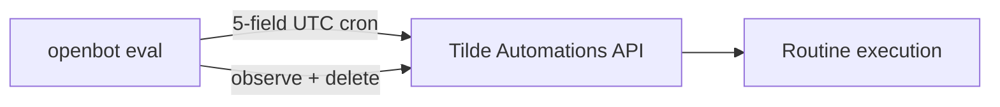

# Intent of the change

- Production Routine eval had temporary six-field workaround after API rejected documented five-field cron.
- API snapshot 180 fixes native Routine normalization.
- Return eval create + update payloads to public `0 7 * * *` format.
- Regression test inspects both PUT payloads.
- Keep lifecycle: create → update → run → observe → delete.

# Architecture changes

No boundary change. `openbot eval` still owns repeatable production measurement; Tilde still owns Routine persistence and execution.

# Summarized package changes

- `openbot` CLI
  - send documented five-field cron on Routine create and update
  - assert exact cron contract in production-evaluation regression test
- No UI, SDK, provider, environment, secret, state import/export, migration, or public command change.
- No Changeset: internal evaluation data correction only.
- Validation:
  - CLI suite: 34 files, 172 tests pass
  - `pnpm check` passes with existing warnings
  - `pnpm build` passes
- Evidence scope: complete PR diff, commits, current task evidence, and prior production-evaluation follow-up reviewed. Environment exposes no supported API for enumerating every local coding-agent task; no complete all-task audit claimed.

# Critical to apply to forks

yes — forks carrying `openbot eval` should use the documented five-field schedule after deploying a Tilde API version with five-field normalization. Apply this commit, then run `openbot eval --scenario routine-lifecycle --json`; require create, update, execution, and cleanup to pass.
