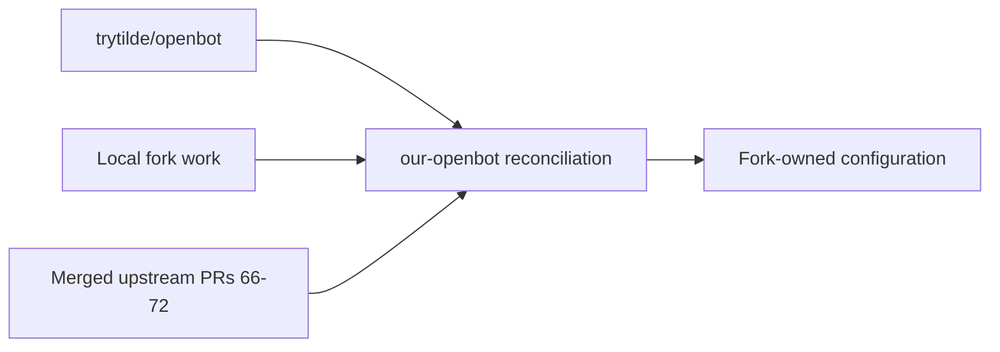

# Intent of the change

Reconcile all current fork work with upstream OpenBot, preserve fork-owned configuration, and retire the completed UI fix ledger.

# Architecture changes

The fork adopts upstream through `c95f86c`, including merged upstream PRs #66–#72. Fork-owned composition remains isolated under `configuration/`.

# Summarized package changes

- Shared runtime, providers, clients, UI, CLI, Computer image, and tests now come directly from upstream.
- Fork-authored agents, templates, environment identifiers, and encrypted configuration remain fork-owned.
- `plan/ui-fixes.md` and superseded Paper Mono assets are removed.

# Critical to apply to forks

yes

This is the fork integration point. Retain this repository's `configuration/` ownership and rebuild the Computer image for the XFCE and Cua changes before deployment.
