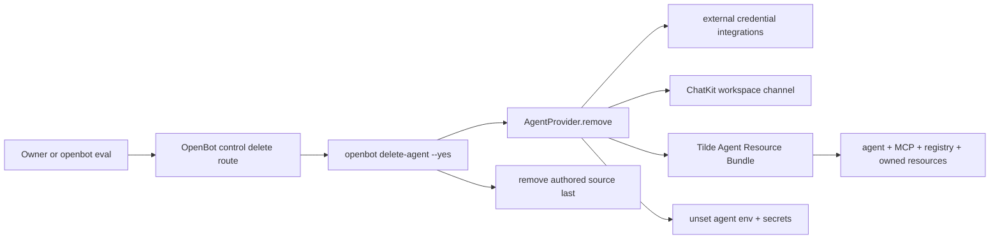

# Intent of the change

- Agent creation worked, but OpenBot had no executable inverse lifecycle.
- Production evaluation could not safely prove create → invoke because cleanup was incomplete.
- Add guarded, repeatable deletion for every non-Factory authored agent.
- Add production measurement that creates through OpenBot, invokes through Tilde ChatKit, and deletes through OpenBot.
- Leave source, environment, encrypted configuration, and Tilde resources clean after evaluation.

# Architecture changes

`AgentProvider` now owns aggregate removal beside aggregate deployment. Control remains thin: it starts the CLI workflow on the trusted Computer and reports the background job. Tilde remains owner of the Agent Resource Bundle.

# Summarized package changes

- `@tryopenbot/agent-provider`
  - add required idempotent `remove(context)` contract
  - delete Vercel MCP integration/credential when owned by the agent
  - delete ChatKit channel and Agent Resource Bundle, then poll until the agent is absent
  - unset every known agent-scoped environment and secret key only after confirmed removal
- `openbot` CLI
  - add `delete-agent <id> --yes [--json]`
  - protect Factory and remove provider resources before source
  - make absent source/remote resources a successful retry
  - add `agent-lifecycle` evaluation with correct native API-key vs control bearer auth and trusted Origin
  - survive the expected watched-runtime restart by independently confirming Tilde deletion
  - restore encrypted SOPS metadata only when every non-SOPS encrypted payload entry equals the pre-evaluation snapshot
- `@tryopenbot/control-service`
  - add owner-authenticated asynchronous delete and deletion-status routes
  - execute deletion in the trusted development checkout, matching creation ownership
- Documentation
  - amend ADR-0011 and agent/CLI/package documentation
  - add fixed-group minor Changeset
- Validation
  - agent provider: 6 files / 16 tests pass
  - control service: 2 files / 36 tests pass
  - CLI: 35 files / 177 tests pass
  - `pnpm check` and `pnpm build` pass
  - live create/invoke/delete: 18.8s, exact `sendMessage`, Tilde 404, source/env absent, zero tracked changes, services healthy with zero restarts
- Evidence scope: full PR diff, commit, governing docs, current task, and production evidence reviewed. Environment exposes no supported API for enumerating every local coding-agent task; no complete all-task audit claimed.

# Critical to apply to forks

yes — forks that create agents must adopt the inverse lifecycle and updated `AgentProvider.remove` contract. Implement removal for any custom agent provider, preserve Factory protection, run `openbot delete-agent <test-id> --yes` twice, then run `openbot eval --scenario agent-lifecycle --openbot-url <control-origin> --json`. Require successful invocation, remote 404, absent source/env, and no tracked checkout changes.
