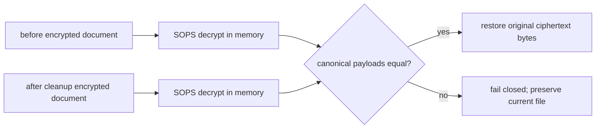

# Intent of the change

- SOPS may re-encrypt unchanged values while temporary agent credentials are added then removed.
- PR 20's guard compared ciphertext and correctly refused restoration when ciphertext changed.
- Compare canonical decrypted payloads instead.
- Preserve fail-closed behavior for any real secret/key/description change.
- Leave production evaluation checkout clean without hiding concurrent edits.

# Architecture changes

No boundary change. The evaluator still snapshots encrypted configuration around its self-cleaning agent lifecycle; only the equality proof changes from ciphertext to canonical plaintext inside the trusted process.

# Summarized package changes

- `openbot` CLI
  - run the existing SOPS executable to decrypt before/after documents in memory
  - canonicalize parsed YAML before equality comparison
  - restore original bytes only on exact decrypted equality
  - skip the snapshot guard when the trusted deployment age identity is unavailable
- Patch Changeset added; no dependency, route, API, schema, state, or provider change.
- Validation:
  - CLI 35 files / 177 tests pass
  - CLI typecheck passes
  - `pnpm check` and `pnpm build` pass
  - production lifecycle passes in 22.9s with one tool call, remote 404, absent source/env, zero tracked changes, healthy zero-restart services
- Evidence scope: full PR diff, commit, current task, and production evidence reviewed. Environment exposes no supported API for enumerating every local coding-agent task; no complete all-task audit claimed.

# Critical to apply to forks

yes — forks using PR 20's `agent-lifecycle` evaluation should apply this fix. Run the lifecycle with `SOPS_AGE_KEY` available, then require a successful create/invoke/delete result and `git status --porcelain --untracked-files=no` to remain empty. A real concurrent plaintext change must still prevent restoration.
