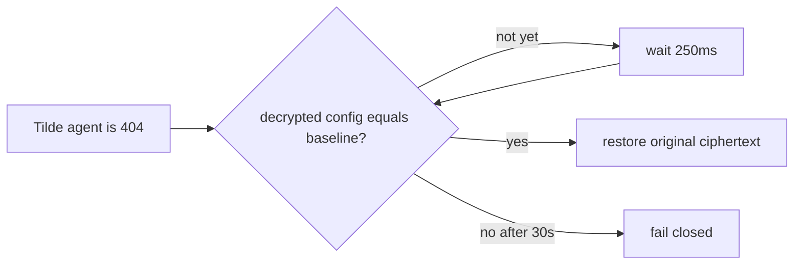

# Intent of the change

- Remote agent deletion reaches Tilde 404 before local credential cleanup always finishes.
- PR 21 compared decrypted payloads at the first remote 404 and could observe temporary keys.
- Wait briefly for local cleanup instead of reporting a false failure.
- Preserve fail-closed behavior for real secret changes.

# Architecture changes

No boundary change. The evaluator adds bounded convergence at the existing local cleanup seam.

# Summarized package changes

- `openbot` retries canonical decrypted equality for up to 30 seconds after deletion.
- Patch Changeset added; no API, state, dependency, route, provider, or client change.
- Validation: CLI 35 files / 177 tests; CLI build; `pnpm check`; production 21.8s create/invoke/delete, one tool call, remote 404, zero tracked changes, zero restarts, health 200.
- Evidence scope: full diff/current task/production evidence reviewed. No supported all-local-task enumeration API is callable; no complete all-task audit claimed.

# Critical to apply to forks

yes — forks using the agent lifecycle evaluator should apply this bounded retry. Prove a production run returns success, Tilde returns 404, and tracked checkout changes remain zero; a persistent plaintext difference must still fail after the bound.
