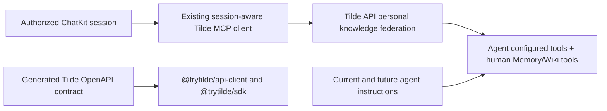

# Intent of the change

OpenBot agents need Tilde's new personal knowledge contract. Human owner session now brings human personal memory-bank and Wiki tools into agent live MCP catalog. Agent identity stays agent. Other human connectors stay hidden. Factory, Pirate Poet, and future agents learn exact rule and Wiki grep use.

# Architecture changes

No new OpenBot runtime seam. `context.session.createMCPClient` already sends ChatKit session ID. Tilde API PR 215 owns authorization, personal source persistence, and provider allowlist. OpenBot refreshes generated contract and adds fork-owned guidance. It does not persist human tool mappings, human IDs, or credentials.

# Summarized package changes

- `@trytilde/api-client`: generated personal Memory source-binding routes and team/personal Wiki grep operations.
- `@trytilde/sdk`: refreshed generated schema used by hand-authored SDK modules.
- Factory and Pirate Poet: recognize account-qualified session-owner `tilde_memory_bank` and `tilde_wiki` tools; never infer user ID or unrelated connector access.
- Future-agent template: same personal knowledge and grep rules for newly scaffolded agents.
- Changeset: minor releases for both changed Tilde packages.
- Checks: frozen install, agent-service provider tests, all Tilde SDK builds/tests through `openbot sdk refresh`, root `pnpm check`, and root `pnpm build`.

# Critical to apply to forks

yes — deploy merged Tilde API PR 215 and its Postgres migration before this OpenBot revision. Then refresh fork SDK artifacts if it carries additional API changes, merge these instruction/template updates into every customized full agent, and redeploy the agent service. No environment variable, secret, state import, CLI, desktop, web, or external dependency migration is required.
