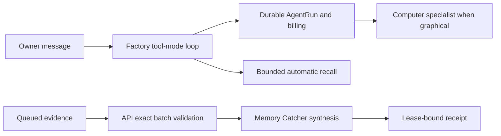

# Intent of the change

Converge the initialized `our-openbot` fork with canonical OpenBot through
automatic memory, durable AgentRuns/work, hosted inference billing, capability
approvals, multiplayer foundations, and the final lease-validated Memory Catcher
runtime while preserving the fork's exe.dev deployment and Computer specialist.

# Architecture changes

- The fork keeps its tracked configuration, encrypted secrets, Code Storage git
  provider, exe.dev runtime, and resource policy that gives the Computer agent a
  fixed least-privilege MCP surface.
- Existing Factory and Pirate Poet agents plus the future-agent template retain
  the fork's tool-mode delegation loop while adding canonical AgentRun recovery,
  compaction, automatic recall, and hosted Gateway billing with stable semantic
  effect scopes.
- Memory Catcher is materialized with the selected Vercel inference provider. It
  validates the exact current API batch, evidence set, and worker lease before
  reserving credits, requires a concrete successful completion receipt, and
  never receives recursive memory or human-communication authority.

# Summarized package changes

- Merges canonical OpenBot through #129 and the API #239 generated contract.
- Preserves fork-only provider policy and materializes canonical propose-only,
  durable work, memory, compaction, and billing behavior into tracked agents and
  future templates.
- Adds focused configuration regressions for the preserved tool loop, stable
  billing effect scope, automatic recall, and exact Memory Catcher validation.
- Leaves `configuration/secrets.enc.yaml` byte-unchanged and adds no plaintext
  secret or generated deployment state.

# Critical to apply to forks

yes — forks with materialized agents must merge the canonical runtime packages,
refresh the API #239 contract, and port the final Factory and Memory Catcher
templates rather than relying on initialization to overwrite owner-authored
files. Preserve provider-specific inference and resource-policy boundaries,
keep automatic memory default-off unless explicitly selected, and verify that
every managed Gateway call uses durable billing while direct owner credentials
and Codex subscription paths remain outside hosted metering.
