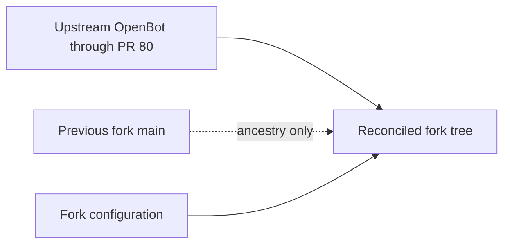

# Intent of the change

Bring the fork onto current upstream OpenBot after all reusable local work was merged upstream, while preserving fork-owned agent composition and local configuration boundaries.

# Architecture changes

No new architecture decision. Shared implementation now comes from upstream through `e8df3ca`; this repository continues to own `configuration/`. An ancestry-only merge connects the former fork main without changing the reconciled tree.

# Summarized package changes

- Adopts upstream PRs #75-#80 and the intervening upstream changes.
- Preserves authored agents, future-agent templates, encrypted secrets, and fork composition.
- Migrates authored agents from the former harness SDK names to `@trytilde/sdk` and `@trytilde/sdk-vercel-ai-node`.
- Keeps plaintext environment and local user configuration untracked.

# Critical to apply to forks

yes

Rebuild a divergent fork from current upstream, transplant only fork-owned configuration, migrate authored-agent imports with the upstream SDK, and connect old fork ancestry only after the resulting tree passes repository gates.
