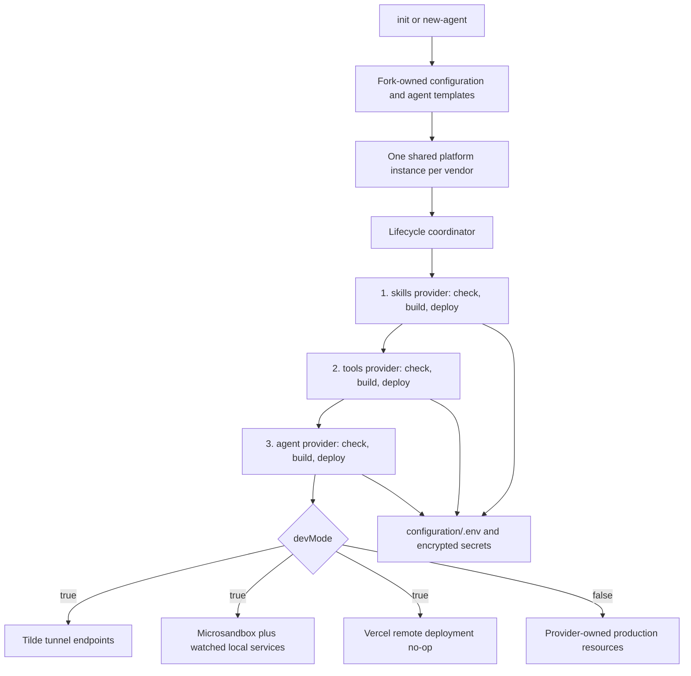

# Intent of the change

- Make platform setup happen once, then share the configured Tilde and Vercel clients across provider roles.
- Make every lifecycle hook idempotent. Repeated init, new-agent, dev, build, and deploy runs converge instead of duplicating external resources.
- Keep authored agents unconstrained: agent code uses vendor SDKs and small runtime utilities directly, while providers own only control data, provisioning, and lifecycle work.
- Replace checked-in Tilde state with typed API reconciliation for agents, skills, tools, registries, and endpoints.
- Make local development observable and reproducible with streamed command output, attributed provider errors, watched services, and replaceable Microsandbox Computers.

# Architecture changes

- `configuration/index.ts` remains the fork composition root. Concrete providers receive shared platform clients instead of asking the same platform questions repeatedly.
- `@tryopenbot/chat-provider` owns control-facing agent, session, and message data. `@tryopenbot/agent-provider` now owns external authored-agent lifecycle reconciliation.
- Provider contracts expose only operations used by the control service, initialization, provisioning, or lifecycle coordination. Authored agents do not import provider packages.
- `@tryopenbot/platform-integrations` contains shared Tilde and Vercel transport, error, deployment, registry, and AI Gateway helpers. `@tryopenbot/computer-tools` contains the agent-safe typed Computer tools. Instrumentation utilities live in `@tryopenbot/configuration`.
- The lifecycle coordinator invokes each agent's skills, tools, and agent deployables in order and passes `agentId`, absolute agent path, and `DeploymentContext.devMode`. Providers own drift checks, mutations, persisted values, and named handoff outputs.
- Tilde reconciliation uses stable identities and typed API calls. It creates or updates the ChatKit agent, exact skill set, skill registry, dynamic MCP server, Tilde control-plane toolkit, optional Vercel MCP server, and Vercel AI SDK endpoint. Development switches applicable endpoints to tunnel mode.
- `tilde.state.yaml` is no longer part of normal operation. Manual Tilde CLI export and import remains the one-time path for moving resources between teams.
- In development, Vercel deployment adapters perform build checks but skip remote deployment. Vercel Sandbox delegates to Microsandbox; Computer image inputs are watched, rebuilt, and replaced while preserving the workspace. Agent and control services run watched local processes.
- The trusted development Computer receives the fork's complete dotenv, encrypted secrets, SOPS configuration, and a Linux-user-readable age identity. Its shell profile loads dotenv and decrypts SOPS values for development processes.

# Summarized package changes

- CLI and initialization
  - Publish the standalone `openbot` executable with built package entrypoints and workspace-source loading for development.
  - Use public `@tryopenbot/*` package names while preserving the `openbot` binary name.
  - Reject initialization in unrelated non-empty directories, accept `owner/name` GitHub repositories, run `vp install`, and let recognized forks revisit existing answers.
  - Scaffold the primary agent at `configuration/agent/` and full additional agents at `configuration/agent/subagents/<id>/`, using fork-owned templates from `configuration/templates/agent/`.
  - Validate Tilde MCP tool registries before narrowing them to Vercel AI SDK `ToolSet`, and typecheck the real default scaffold so generated agents cannot fail only during provider build checks.
  - Stream long-running command output through Ink, show progress and completion states, attribute provider failures to the concrete implementation and provider role, and print full error stacks.
- Provider and lifecycle packages
  - Add shared `Platform` implementations and platform integrations for Tilde and Vercel.
  - Split chat operations from authored-agent provisioning, narrow skills and tools interfaces, and remove unused generic registry/server methods from public contracts.
  - Add per-agent lifecycle scheduling and mutable environment persistence helpers while retaining named deployment outputs.
  - Make Tilde skills, tools, and agent adapters reconcile resources idempotently and report actionable vendor errors.
  - Make Vercel service adapters development-safe and make the Vercel Computer adapter use Microsandbox during development.
  - Import locally built Computer images into the Microsandbox cache and disable registry pulls, preventing repository-derived local tags from being mistaken for Docker Hub images.
- Authored-agent runtime
  - Remove provider imports from default agent code and templates. Agents use direct AI SDK/vendor integrations plus `@tryopenbot/computer-tools` and `@tryopenbot/configuration` runtime helpers.
  - Give the primary agent and every subagent the same instrumentation, skills, tools, sandbox workspace seed, and ChatKit entrypoint shape.
- Build and packaging
  - Add browser and Node tsdown configurations, public package exports, package artifact verification, and local-package Docker build inputs so fresh workspaces do not depend on prebuilt or unpublished packages.
- Documentation and release
  - Rewrite provider and lifecycle documentation, amend ADRs 0001, 0004, 0006, 0007, 0008, and 0011, and update shipped skills and `AGENTS.md` with the new ownership rules.
  - Preserve actionable out-of-scope feature planning found during PR thread audits as exact `FOLLOW UP` blocks in PR metadata, while keeping fork update records limited to implemented changes.
  - Add a fixed-group pre-1.0 minor changeset for the breaking public package and lifecycle changes.
- Proof
  - Focused provider and CLI suites passed: 98 tests passed and 2 were skipped.
  - `pnpm check` passed with no errors and 10 existing non-blocking warnings.
  - `pnpm build` passed, including public package artifacts and standalone CLI verification.

# Critical to apply to forks

yes

- Pull this update before changing provider composition or creating more agents; package boundaries and lifecycle contracts are breaking.
- Move the primary authored agent to `configuration/agent/`. Move every additional full agent to `configuration/agent/subagents/<id>/`; nested subagents and the legacy plural layout are unsupported.
- Keep `configuration/templates/agent/` aligned with the current primary/subagent structure so future `openbot new-agent` scaffolds the same integrations.
- Remove provider imports from authored agents. Integrate model, prompt, tool, MCP, and vendor behavior directly; use `@tryopenbot/computer-tools` only for standard Computer tools and `@tryopenbot/configuration` for shared instrumentation helpers.
- Update custom deployables to accept `DeploymentContext.devMode` instead of `target`, remain idempotent, and own their environment/secrets persistence. Preserve named outputs only for real provider handoffs.
- Replace split runtime-provider composition files with explicit concrete providers under `Configuration({ providers: { ... } })`, sharing one platform instance per vendor.
- Delete `tilde.state.yaml` from the fork. Re-run initialization in the recognized workspace to supply missing platform values, then let `openbot dev` or deployment reconcile Tilde resources. Use the Tilde CLI manually only for a one-time team export/import.
- Treat the trusted development Computer as receiving the entire `configuration/.env` and encrypted secret set. Confirm its SOPS age identity has read permission only for the sandbox Linux user.
- Run `vp install`, then `openbot dev`. Confirm skills, tools, and agent reconciliation completes; local services enter watch mode; and Computer image changes replace the Microsandbox without losing its workspace.
