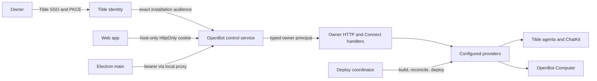

# Intent of the change

- Ship the first integrated owner workspace: Tilde-backed chat, continuous streaming, attachments, queued turns, responsive navigation, and one agent workspace with an isolated Computer preview.
- Make fork configuration executable and explicit. Provider roles are constructed in `configuration/index.ts`; development and production reconcile provider-owned resources before starting runtimes.
- Protect every owner-facing control route. Tilde Identity issues public-client PKCE credentials bound to one OpenBot installation; browser credentials stay in host-only HttpOnly cookies and Electron credentials stay in the main process.
- Keep the implementation clean-room. Another desktop agent supplied behavioral requirements only; no source, identifiers, or prose are reused.

# Architecture changes

- Adds `@tryopenbot/auth-provider`. Its core contract owns authorization metadata and principal validation; the Tilde adapter performs discovery, installation registration, PKCE token exchange/refresh, and strict JWT verification.
- Adds control-service auth middleware and bounded login, callback, refresh, logout, and session routes. Static assets and health remain public. Owner chat, attachment, control RPC, and Computer-preview surfaces require an authenticated principal.
- Adds a web auth gate without exposing access or refresh tokens to browser JavaScript.
- Adds Electron system-browser authentication, main-process PKCE and refresh handling, OS-protected credential storage, and bearer injection in the existing loopback proxy. The preload bridge exposes only bounded auth state and commands.
- Splits chat behavior into the chat provider and owner-facing control proxy. Tilde remains authoritative for agents, ChatKit sessions, tools, skills, and memory; OpenBot owns installation control and Computer lifecycle.
- Extends provider deployment reconciliation so owner chat, auth metadata, workspace sources, and service-specific environments reach the correct local or Vercel artifact without leaking build-only credentials into runtime.
- Adds agent-centric workspace and Computer tooling. Agent source and one-time workspace seeds are discovered from `configuration/agents/<id>/`; typed Computer tools bind the path-derived agent ID outside model-visible schemas.

# Summarized package changes

- `apps/web`: owner workspace shell, continuous/queued chat, rich message content, upload handling, responsive layouts, Computer preview, and authentication gate.
- `apps/control-service`: authenticated owner boundary, chat proxy, Computer preview, expanded control RPC behavior, route tests, and portable Web-standard request handling.
- `apps/desktop`: secure native OAuth lifecycle, narrow preload bridge, authenticated loopback proxying, and packaging coverage.
- `apps/computer-service`: desktop-session support, stricter agent/capability routing, startup recovery, and typed service composition.
- `cli`: explicit configuration loading, provider initialization, agent scaffolding, local development reconciliation, service-specific deployment, environment/secrets handling, and repository-root fixes.
- `packages/auth-provider`: new OIDC provider contract plus Tilde implementation and lifecycle tests.
- `packages/chat-provider`: extends the Tilde adapter for owner ChatKit sessions, history, attachments, and streaming.
- `packages/agent-provider`: expanded Tilde agent reconciliation and runtime behavior.
- `packages/agent-service-provider` and `packages/control-service-provider`: separate local/Vercel artifacts, provider-owned generated assets, environment installation, and deploy lifecycles.
- `packages/computer-provider`, `packages/computer-tools`, and computer protobuf: shared Computer lifecycle, fixed-agent typed tools, desktop operations, and generated contract changes.
- `packages/runtime-provider`: carries the additional reconciled runtime outputs needed by the integrated workspace and authentication flow.
- `packages/platform-integrations`: hardens reusable Tilde and Vercel registry/deployment adapters used during initialization and deploy.
- `packages/tools-provider`: preserves Tilde tool reconciliation across the integrated owner flow.
- `packages/configuration`: adds the authentication provider role to explicit fork composition.
- Documentation: ADRs record owner chat, desktop sessions, and installation authorization; lifecycle, configuration, sandbox, agent, provider, provenance, and contributor docs match the new boundaries.
- Release: Changesets cover the owner-visible and public package changes as one fixed workspace release group.

# Critical to apply to forks

yes

This PR changes fork composition, public package surfaces, generated protobuf contracts, initialization output, development startup, deployment orchestration, agent layout, secrets, and owner authentication. Customized forks must update deliberately:

1. Re-run `pnpm install` with Node 24 and pnpm 10, then regenerate contracts with `pnpm contracts:generate`.
2. Add an authentication provider to fork composition and reconcile custom provider extensions with the updated runtime, platform-integration, and service-provider contracts. Keep provider contracts in each package's `src/core.ts` or `src/core/index.ts`.
3. Reconcile `configuration/index.ts`, runtime-provider construction, instrumentation, and every configured agent under `configuration/agents/<id>/`. Do not copy upstream's `configuration/.gitignore` sentinel over an initialized fork.
4. Re-run `openbot init` or reproduce its new public Tilde metadata and encrypted-secret outputs. Keep `configuration/.env` untracked; keep team API keys, deployment credentials, and Computer service keys only in `configuration/secrets.enc.yaml`.
5. Register each installation with Tilde Identity. Configure its exact issuer, client ID, installation audience, team/installation identifiers, and supported web/native redirects. Never encode an installation ID as an OAuth scope.
6. Preserve browser host-only HttpOnly cookie handling and Electron main-process credential storage. Do not expose access or refresh tokens through renderer code, preload APIs, protobuf state, logs, or deployment outputs.
7. Review custom Vercel/local providers against build and deployment contracts, environment allowlists, secret installation, and service-specific deploy behavior.
8. Review custom agents against the Eve-compatible directory subset and fixed-agent Computer tools. Existing deployed workspace seeds are one-time and are not overwritten by later repository edits.
9. Run `pnpm check`, `pnpm build`, `pnpm test:e2e`, and `pnpm --filter @openbot/desktop package`; verify login, refresh, logout, wrong-audience rejection, owner chat, attachments, Computer preview, and deployment dry-run on the customized fork.

No database migration is introduced. Existing installation access tokens cannot be revoked immediately and remain valid until their short expiry; unlink and revocation management are deferred.
