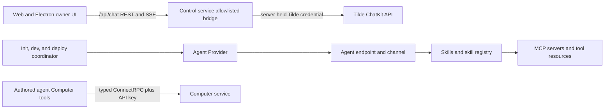

# Intent of the change

- Collapse each authored agent's Tilde skills, skill registry, MCP servers, and tool resources into one Agent Provider lifecycle.
- Remove provider roles that only mirrored control-service operations instead of owning initialization, external provisioning, or build/deploy work.
- Make owner chat use Tilde's native REST/SSE protocol through the existing allowlisted same-origin bridge.
- Keep the Computer service's typed, API-key-protected ConnectRPC boundary because it remains an internal runtime capability service.
- Accept the pre-1.0 break deliberately: no compatibility adapters remain for the deleted providers or owner RPC contract.

# Architecture changes

- `TildeAgentProvider` is now the aggregate owner for the complete external Tilde footprint of an authored agent. Internal skill and tool reconcilers remain cohesive modules under `packages/agent-provider/src/tilde/` and run after the agent endpoint/channel exists.
- The configuration contract no longer exposes `chat`, `skills`, or `tools` provider roles. CLI initialization and lifecycle scheduling no longer construct or sequence them separately.
- `@tryopenbot/chat-provider`, `@tryopenbot/skills-provider`, `@tryopenbot/tools-provider`, and `@tryopenbot/control-service-proto` are deleted.
- The browser keeps Tilde ChatKit's native request and streaming shapes at `/api/chat/*`. The control service constrains the upstream path, injects its server-held credential, strips browser credentials, and removes private upstream response headers.
- Local, Electron, Vite, and Vercel routing consistently forwards `/api/*`. The owner `/rpc` route and generated owner protobuf contract are gone.
- Installation authentication remains a provider because it owns external OIDC client registration plus initialization/deployment. Its former `/rpc` middleware coverage is removed; it continues to protect the owner REST and Computer-preview routes.
- Computer ConnectRPC is unchanged. It is not a composition abstraction for browser control state; it is the typed internal service used by agent-safe Computer tools.
- ADRs 0004, 0005, 0008, 0009, and 0014 record the resulting provider, protocol, service, and product boundaries.

# Summarized package changes

- Agent resources
  - Move Tilde skill and tool reconciliation implementations and tests under `@tryopenbot/agent-provider`.
  - Add internal skill/tool input types and translate internal reconciliation failures to `AgentProviderError` at the aggregate boundary.
  - Reconcile endpoint/channel/credentials first, authored skills and registry second, then MCP/tool resources.
- Control and frontend transport
  - Delete the owner ConnectRPC handler and control protobuf package.
  - Remove `chatProvider` composition from local and Vercel control-service artifacts.
  - Retain the allowlisted Tilde REST/SSE bridge and route `/api/*` through development, packaged desktop, and Vercel surfaces.
  - Update installation-auth tests to protect real REST routes rather than the deleted `/rpc` namespace.
- Configuration and lifecycle
  - Remove the `chat`, `skills`, and `tools` fields from `OpenBotProviders`.
  - Remove the deleted providers from initialization, development/deployment scheduling, generated configuration templates, package dependencies, and the workspace lockfile.
  - Keep `auth`, service, agent, computer, and inference providers because they own initialization/provisioning or build/deploy lifecycles.
- Documentation and release
  - Update repository maps, provider/configuration guidance, package READMEs, and the five governing ADRs.
  - Add a breaking pre-1.0 minor changeset and remove deleted package names from all still-pending changesets.
- Proof
  - `pnpm changeset:status` passed.
  - `pnpm check` passed with 0 errors and 6 existing CLI warnings.
  - `pnpm build` passed, including package and standalone CLI verification.
  - `pnpm test` passed across all workspace packages with loopback permission for the Electron server test.
  - Control-service tests passed 13/13 and Playwright passed 6/6.

# Critical to apply to forks

yes

- Remove `TildeChatProvider`, `TildeSkillProvider`, and `TildeToolProvider` imports and the `providers.chat`, `providers.skills`, and `providers.tools` configuration fields.
- Keep one shared Tilde platform instance and pass it to `new TildeAgentProvider(tilde)`. Keep the installation auth provider when the fork uses Tilde OIDC registration.
- Do not rename or delete existing `AGENT_*`, skill registry, MCP server, or toolkit environment values. The aggregate Agent Provider reuses those identities and reconciles them idempotently.
- Update custom lifecycle code that assumed skills, tools, and agents were separate deployable participants. Schedule only the aggregate Agent Provider for authored-agent Tilde resources.
- Replace owner ConnectRPC clients with the native `/api/chat/*` REST/SSE client. Ensure custom local, desktop, and hosting routes forward `/api/*` to the control service.
- Remove dependencies on the four deleted packages and run `pnpm install` to refresh workspace links and the lockfile.
- Leave Computer service clients on `@tryopenbot/computer-service-proto` and ConnectRPC. That internal API did not migrate.
- Run `pnpm check`, `pnpm build`, `pnpm test`, and `pnpm test:e2e` after updating fork-owned configuration and routes.
