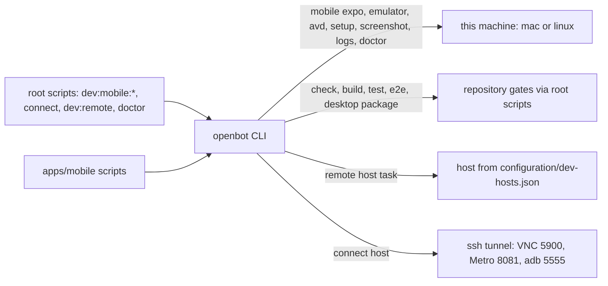

# Intent of the change

- Give the four-target mobile development topology one owner with tests: local mac, local Linux, remote mac, remote Linux.
- Move Expo, emulator, and toolchain logic out of untested `apps/mobile/scripts/*.mjs` into the published `openbot` CLI, so fork developers and sandboxed agents get the same versioned tooling.
- Make repository gates commands rather than only root scripts.
- Keep development-host identity out of package code.
- Record that every future developer workflow lands as a CLI command, and enforce it in `create-pr`.

# Architecture changes

- One CLI owns operator commands and developer workflow. A separate `@tryopenbot/dev-cli` package was built and folded back in before publication; ADR-0018's Updates record the reversal.
- Gates delegate to the root `package.json` scripts, which stay the single definition of what each gate runs. The CLI never duplicates a `vp` command line.
- `cli/src/toolchain.ts` resolves the Android SDK and takes Node from `process.execPath`, because Gradle shells out to `node` while evaluating settings and fails on a version-manager shim.
- Host names, addresses, platforms, and paths live in fork-owned `configuration/dev-hosts.json`. Package code carries no machine identity.
- Everything on a remote binds loopback; the `connect` ssh tunnel is the only path in.

# Summarized package changes

- `cli` — new modules `toolchain.ts`, `workspace.ts`, `hosts.ts`, `tunnel.ts` and commands `mobile/` (expo, emulator, avd, setup, screenshot, logs, doctor), `connect.ts`, `remote.ts`. Dispatch gains `e2e` and `desktop package`; `delegate` is split so package-filtered scripts can be delegated too. Tests rise from 66 to 77. `README.md` documents the full command surface and the `dev-hosts.json` shape.
- `apps/mobile` — `scripts/*.mjs` deleted; package scripts delegate to `openbot`. No source change.
- root `package.json` — verb:target taxonomy: `dev:mobile`, `dev:mobile:android`, `dev:mobile:ios`, `dev:mobile:emulator`, `connect`, `dev:remote`, `doctor`.
- `docs/adrs/0018-developer-workflow-cli.md` — new decision with its full revision history.
- `AGENTS.md`, `README.md`, `apps/mobile/README.md`, `.agents/skills/run-expo/SKILL.md` — rewritten around the CLI commands.
- `.agents/skills/create-pr/SKILL.md` — new CLI ownership gate, step 6 of the required order.
- `.changeset/fix-local-oauth-callbacks.md` — repaired: it arrived on `main` with PR 45 naming the pre-rename `@tryopenbot/computer-provider`, which broke `pnpm changeset status` for everyone.

# Critical to apply to forks

yes

**A fork that customized the mobile scripts must move that work.** `apps/mobile/scripts/expo.mjs`, `toolchain.mjs`, and `android-emulator.mjs` are deleted. Their behavior now lives in `cli/src/toolchain.ts` and `cli/src/commands/mobile/`. A fork that edited those files — a different SDK path, extra emulator flags, a different AVD — will see the files vanish on merge and must reapply the change in the CLI. `pnpm --filter @tryopenbot/mobile dev`, `android`, `ios`, `build`, and `start` keep working unchanged, because only their script bodies moved.

**Root script names changed.** Anything automating the old `pnpm --filter @tryopenbot/mobile emulator` should call `pnpm dev:mobile:emulator` or `openbot mobile emulator`. CI that shells the mobile scripts directly needs no change.

**Remote development hosts are new fork-owned configuration.** A fork that develops on remote machines creates `configuration/dev-hosts.json` with its own `{ "hosts": { "<name>": { "ssh", "platform", "path" } } }`. It stays untracked upstream and must never be committed to `trytilde/dispatch`. Without it, `connect` and `remote` still accept a raw `user@host`.

**Check the changeset repair.** A fork carrying its own copy of `.changeset/fix-local-oauth-callbacks.md` from PR 45 has the same broken package name and the same `pnpm changeset status` failure; rename `@tryopenbot/computer-provider` to `@tryopenbot/computer-service-provider` there too.

Run `pnpm install`, then `pnpm doctor` to confirm the toolchain, then `pnpm check` and `pnpm build`.
