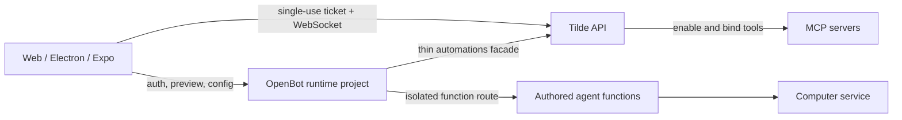

# Intent of the change

- One OpenBot deployable. Control API, static web, isolated agent functions share one runtime project.
- Less OpenBot orchestration. Tilde owns unified automation roots, trigger reconciliation, runs, and bulk provider-tool binding.
- Direct Mission Control stream. Clients connect to Tilde WebSocket after narrow ticket exchange.
- Ready barrier stays bounded. Inactive bot history hydration cannot block later live socket events.
- Safe migration. Existing split providers and persisted origins remain readable until healthy cutover completes.
- Fork behavior kept. Primary agent, existing subagent, future templates learn unified tool-binding call.

# Architecture changes

- `VercelRuntimeServiceProvider` and `LocalRuntimeServiceProvider` satisfy both control-service and agent-service deployment contracts.
- Runtime deployment health precedes Tilde endpoint cutover. Persisted `AGENT_SERVICE_ORIGIN` changes only after success. Local legacy agent service retires last.
- Browser/Electron use exact-origin socket tickets. Expo uses native transport classification. Long-lived bearer stays outside browser WebSocket URLs and subprotocol storage.
- Routines route maps directly to Tilde automations. No metadata-wide scan or OpenBot-owned trigger fan-out remains.
- Connector setup asks Tilde to enable all or selected provider tools and bind them to passed MCP server IDs.

# Summarized package changes

- `@tryopenbot/agent-service-provider`: adds consolidated local and Vercel runtime providers, isolated function build, health/cutover lifecycle, tests, public exports, README updates.
- `@tryopenbot/control-service`: adds Mission Control ticket exchange, thin automation facade, unified bulk tool binding, tests, and removes direct `ws` dependency.
- `@tryopenbot/client-runtime`: adds direct Mission Control WebSocket transport, ready barrier, durable cursor handling, heartbeat/reconnect, post-apply dedupe, and platform transport selection.
- `@trytilde/api-client` and `@trytilde/sdk`: refresh generated contracts for unified automations, socket tickets, hosted runtime fields, and bulk provider-tool binding.
- `@tryopenbot/auth-provider`: registers exact development origins used by browser tickets.
- `@tryopenbot/computer-service-provider`: selects consolidated runtime or legacy agent Vercel project explicitly.
- `@tryopenbot/control-service-provider`: exports reusable runtime build and safe local service retirement helpers.
- `openbot` CLI: builds/deploys one runtime when providers are shared, preserves split composition, orders endpoint cutover safely, and updates initialization templates.
- Desktop: derives a narrow Tilde WebSocket CSP origin. Mobile: selects native Mission Control transport. Web: consumes shared browser behavior.
- Fork configuration: uses one Vercel runtime provider for control and agent roles; updates primary, subagent, and future-agent Tilde skills.
- ADRs 0006, 0008, 0014, 0016, and 0031 record deployment, transport, authentication, and automation ownership decisions.
- One fixed-group Changesets entry records owner-visible behavior.

# Critical to apply to forks

yes — fork composition must opt into the consolidated runtime and its Tilde API dependencies.

- Replace separate Vercel control/agent providers with one `VercelRuntimeServiceProvider` instance assigned to both roles. For local composition, use one `LocalRuntimeServiceProvider` instance.
- Set Vercel Computer `projectRole: "runtime"` only when using consolidated deployment. Leave the default legacy agent role for split composition.
- Deploy against a Tilde API version containing unified automations, Mission Control socket tickets/direct WebSocket protocol, and enable-and-bind provider tools.
- Keep the old agent endpoint live through the first healthy consolidated deployment. The CLI performs the safe cutover and retires legacy local service afterward.
- Propagate updated Tilde skills into customized authored-agent and subagent trees if those files diverged from templates.
- Verify browser deployment origins are registered exactly. Verify Electron CSP contains only the configured Tilde `wss:` origin.
- Run `pnpm check`, `pnpm build`, affected client/runtime tests, browser E2E, and desktop packaging for customized forks.
- Browser E2E fixtures must mock the direct socket ticket and `mission_control.ready` protocol; the retired Mission Control SSE endpoint no longer drives live owner state.
- No new external dependency is required. No secret should be copied into tracked configuration or migration state.
