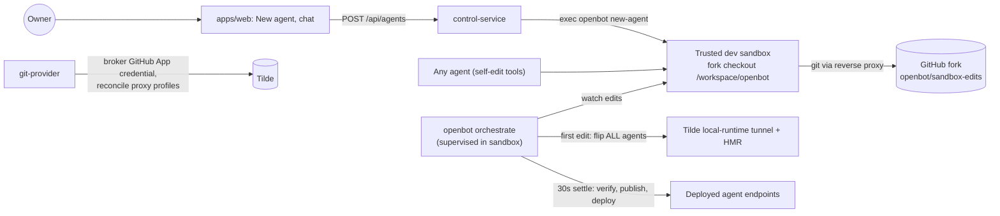

# Intent of the change

- Primary agent becomes the factory: the one agent an owner chats with to create, tweak, and ship other agents. Hello-world removed, not renamed-in-place — its CLI template assets are deleted.
- Give the factory a real authenticated git client: the trusted development sandbox holds the fork checkout and pushes through a Tilde reverse proxy. No GitHub token in the repository, in `configuration/`, or inside any Computer. Ever.
- New `git-provider` domain pays the ADR-0013 debt note about a future code-forge/`GitProvider` domain.
- Take the software lifecycle away from agents. A background orchestrator (`openbot orchestrate`, ADR-0019) owns build/verify/publish/deploy; agents stay lifecycle-unaware and only edit source. Every subagent can edit itself.
- Web workspace drops build/test/deploy chrome. "New agent" scaffolds via the CLI in the dev sandbox and opens a chat with the created agent itself.

# Architecture changes

- `GitHubGitProvider` brokers a GitHub App credential through Tilde (`server_token_exchange` via provider-app provisioning). Never a raw PAT. Reconciles `openbot-github-rest` (api.github.com) and `openbot-github-git` (github.com) reverse-proxy profiles; persists `GIT_GITHUB_*`.
- Init runs GitHub App authorization interactively: asks App name (globally unique) plus optional owning organization, serves GitHub's auto-submitting App-manifest form from an ephemeral loopback server, renders a full-page Ink panel, auto-opens the browser, polls until the credential connects (10-minute timeout). Non-interactive or failed runs degrade to pending events; init never fails on it. Fork repository is derived from the checkout's `origin` remote — no extra question.
- Dev sandbox attaches its seeded tree to the fork with repository-local git config: identity, `insteadOf` rewrite of `https://github.com/` through the Tilde git proxy with team API-key headers, `origin` and `upstream` remotes. The sandbox never sees a GitHub token.
- Orchestrator state machine: `deployed → live → publishing`. First edit flips every agent to the tunnel — whole-repo, never per-agent, because shared files affect any agent. After 30 s without file changes it verifies the project, pushes to `openbot/sandbox-edits` through the git proxy, redeploys agent services, flips agents back to deployed endpoints. A failed stage leaves agents on the tunnel and retries after the next settle. Watcher ignores lifecycle-owned paths (`configuration/.env`, `secrets.enc.yaml`, `.sops.yaml`) — no self-trigger.
- Orchestrator runs supervised inside the dev sandbox: development setup installs a restart-looped supervisor; the computer image carries the pinned `cloudflared` binary the tunnel needs.
- Per-agent ChatKit workspace channels; Tilde routes sessions via each channel's default agent. Only the primary agent gets the brokered GitHub toolkit (deployment context distinguishes primary from subagent).
- Secret writes use `sops set`, which reuses the file's existing data key — a single age recipient (the sandbox) can persist agent credentials without KMS access. A failed persist previously stranded fresh Tilde signing keys and broke webhook signatures.
- Vercel Sandbox hardening: services revived after resume (processes do not survive), computers and the dev sandbox replaced on image-tag drift.

# Summarized package changes

- `packages/git-provider` — new. `GitProvider` contract in `core.ts`, `GitHubGitProvider` under `github/`, contract tests, README.
- `cli` — new `commands/orchestrate.ts` (settle timer, watch set, `SANDBOX_EDITS_BRANCH`); `development-lifecycle.ts` reconciles the dev sandbox from `openbot dev`; init gains the interactive GitHub panel with an injectable reporter (Ink stays in the command), `SOPS_AGE_KEY` short-circuits owner-identity resolution headlessly, `sops set` secret writes, scaffolds `configuration/tsconfig.json`; factory agent + subagent `self-edit` template assets added, hello-world assets deleted.
- `packages/configuration` — `providers.git?: GitProvider` slot in the composition contract.
- `packages/agent-provider` — per-agent ChatKit workspace channels; brokered GitHub toolkit for the primary only; reconciliation tolerates a purged tool group; agent instructions distinguish direct tools from registry meta-tools.
- `packages/agent-service-provider` — discovery registers the primary as `factory`.
- `packages/computer-service-provider` — development setup installs the orchestrator supervisor; repository-local git proxy configuration; Vercel resume/image-drift hardening in `vercel/`, `base/`, `core/`.
- `packages/runtime-provider` — deployment context carries agent kind (primary vs subagent).
- `apps/control-service` — `POST /api/agents` (`agent-create.ts`) execs `openbot new-agent` in the dev sandbox.
- `apps/web`, `packages/ui`, `packages/client-runtime` — "New agent" in `WorkspaceSidebar` (`onCreateAgent`), `client-runtime` `createAgent`; no build/test/deploy modes. Ported onto the v2 UI after rebase.
- `docs` — new ADR-0019 (sandbox live runtime and background SDLC; landed as a second ADR-0017 alongside PR 47's and renumbered during this backfill) and ADR-0020 (brokered hosted-git access, recorded retroactively); ADR-0001 and ADR-0011 prose now name `factory`; `providers.md` gains the git-provider row; `lifecycle.md`, `agents.md`, `configuration.md`, `AGENTS.md`, `CONTEXT.md`, `README.md` updated.
- `.changeset/add-factory-agent-and-git-provider.md` — ten workspace packages, all minor.

# Critical to apply to forks

yes

**Primary agent ID changed: `hello-world` → `factory`. Breaking.** The fork keeps its existing `configuration/agent/` directory, but discovery now registers the primary as `factory`. Redeploy agents once (`pnpm openbot deploy --yes --service agents`). Secrets migrate: `AGENT_HELLO_WORLD_API_KEY` is dead; the next reconcile mints `AGENT_FACTORY_API_KEY` and registers the ChatKit endpoint with fresh credentials. Chat history on the old hello-world inbox does not carry over.

**Hello-world template assets are deleted.** A fork that customized `cli/src/assets/agents/hello-world/**` must reapply those edits under `cli/src/assets/agents/factory/**` (tools are shared shape; instructions and skills differ).

**Rerun `pnpm openbot init`.** It derives `GIT_GITHUB_REPOSITORY` from the checkout's `origin` remote, runs the interactive GitHub App authorization (App name is globally unique per customer; optional organization), and persists `GIT_GITHUB_*`. The composition root gains `git: new GitHubGitProvider(tilde)` — a fork that hand-maintains `configuration/index.ts` instead of re-rendering must add the `providers.git` slot itself.

**Finish GitHub authorization, then redeploy.** A pending credential surfaces as a `git.github.authorization.required` event and never blocks init or dev; the deployment lifecycle is the idempotent finisher that reconciles the reverse-proxy profiles and the sandbox git remotes.

**Do not repurpose `openbot/sandbox-edits`.** The orchestrator force-owns that branch for automated publishes. Merging it into the default branch stays an explicit owner (or requested-agent) pull request — no auto-merge yet.

**Trust boundary widened — review before adopting.** Every agent's computer tools now execute in the trusted development sandbox, so every agent operates inside the boundary that previously applied only to the factory agent. A fork running untrusted third-party agents must weigh this before upgrading.

Run `pnpm install`, `pnpm check`, `pnpm build`, `pnpm test`.
