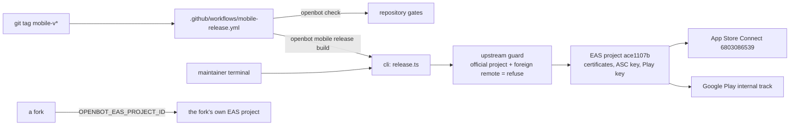

# Intent of the change

- Prove the mobile client on real hardware — Apple Silicon macOS and this display-less Linux host — instead of trusting that a bundle that exports also builds.
- Give OpenBot a published mobile identity: Tilde publishes, OpenBot is the app. One EAS project, one identifier, upstream only, with the fork guard as code rather than a comment.
- Make releasing repeatable. A `mobile-v*` tag builds and submits; a maintainer's shell history stops being the pipeline.
- Move onboarding state into `client-runtime` where ADR-0017 already put every other major surface, and green the e2e suite that was red on `main`.
- One app icon across iOS, Android, Electron, and the web.

# Architecture changes

- ADR-0027 records store publication. `apps/mobile/app.json` becomes `app.config.ts`, so store identity resolves from the environment with the official values as defaults: `OPENBOT_EAS_PROJECT_ID`, `OPENBOT_APP_ID`, `OPENBOT_EXPO_OWNER`, plus name, slug, and scheme. The identifier is reverse-DNS of the publisher, `ai.trytilde.openbot`, not of the product.
- `openbot mobile release build|submit|status|credentials|install` is the only publication path. The guard refuses when the resolved EAS project is the official one and `origin` is not `trytilde/dispatch`, naming the override a fork needs. `build` and `submit` require `--yes`; `install` and `status` do not, because neither spends minutes nor changes a listing.
- CI calls the CLI, not `eas-cli`, so automation and a human share one guard. The job is additionally fenced to `github.repository == 'trytilde/dispatch'`. Its only secret is `EXPO_TOKEN`; certificates, the App Store Connect API key, and the Play service account key stay in EAS.
- `apps/mobile` gains an `eas-build-post-install` script. EAS never invokes the OpenBot CLI, so the CLI's unbuilt-dependency guard could not help there; the hook builds `client-runtime` inside the EAS worker instead.
- Onboarding state moves to `packages/client-runtime`: grouped contract, reducer, and an `OnboardingStorage` structural port. `apps/web` supplies browser storage. `agentAvatarShapeSchema` stays an open string set because the UI registers shapes by name.
- Toolchain resolution moved into `cli/src/toolchain.ts` rather than into command call sites: a real Node binary via `process.execPath` for Gradle's `node` spawn, the Android SDK root, the NDK version read from React Native's own `gradle/libs.versions.toml`, and a system image chosen by `process.arch`.
- `mobile doctor` resolves the JDK the way Gradle does — `JAVA_HOME` first, then `PATH`, noting shadowing — and reads the Xcode minimum from the installed React Native's `min_xcode_version_supported`. It reports hostile compiler search paths (`CPPFLAGS`, `LDFLAGS`, `CPATH`) without changing them: per-developer tool configuration belongs in a developer's own environment, not baked into the project.
- Failed diagnostics are marked as diagnostics, so `mobile doctor` reporting a missing tool no longer renders as an unexpected CLI crash.

# Summarized package changes

- `apps/mobile` — `app.config.ts` replaces `app.json`; `eas.json` with development, preview (APK, internal), and production profiles, remote `appVersionSource`, and the `ascAppId` for submission; `assets/icon.png` and `assets/adaptive-icon.png`; `eas-build-post-install`.
- `cli` — `commands/mobile/release.ts` (new); `commands/desktop/{index,dev,package}.ts` (new); `upstream.ts` (new) and its tests; `virtual-display.ts` (new) shared by the emulator and the desktop shell; `diagnostics.ts` (new); substantial `commands/mobile/doctor.ts` and `toolchain.ts` work with tests; `commands/mobile/expo.ts` detects an unbuilt workspace dependency by its runtime entry rather than its first `exports` target.
- `packages/client-runtime` — `contracts/onboarding.ts` and `onboarding.ts` with tests.
- `apps/web` — `auth-gate.tsx` calls `runtime.actions.initialize()` and drives onboarding through the runtime. The missing `initialize()` call is why the sidebar loaded forever.
- `apps/desktop`, `apps/web` — the shared mark as `build/icon.png` and `public/icon.png`; the unrelated placeholder `build/icon.svg` is deleted.
- `tests/e2e` — assertions follow ADR-0025 segmented transcript rendering; `onboarding-state.ts` seeds first-run state. Suite goes from 5 failed / 1 passed on `main` to 6 passed.
- `.github/workflows/mobile-release.yml` — new.
- `docs` — ADR-0027 (new); `CONTRIBUTING.md` gains per-platform prerequisites, from-scratch Linux and macOS setup, publication, and automated releases; `create-pr` gains cross-client parity, CLI ownership, and external dependency gates; `run-expo` records what is verified per platform.
- 15 changesets.

# Critical to apply to forks

yes

**Bundle identifier changed: `dev.openbot.mobile` → `ai.trytilde.openbot`.** A fork that had installed its own build under the old identifier gets a separate app, not an upgrade. A fork publishing its own app should set `OPENBOT_APP_ID` in `configuration/.env` rather than inherit either value.

**`apps/mobile/app.json` is gone.** A fork that edited it must move those values into environment overrides read by `app.config.ts`; the file itself is upstream-owned now.

**Publication is upstream-only and does not need setup.** `openbot init` still never asks about EAS. A fork that wants its own app sets `OPENBOT_EAS_PROJECT_ID`, `OPENBOT_APP_ID`, and `OPENBOT_EXPO_OWNER`; without them, `openbot mobile release` refuses and names the overrides.

**New external requirements, all checked by `openbot mobile doctor`.** A JDK 17 or 21 — JDK 25 fails `:react-native-worklets:configureCMakeDebug` inside a restricted `java.lang.System` method. The React-Native-pinned NDK and CMake, which `openbot mobile setup` now installs. Xcode 16.1 or newer for iOS, with the minimum read from the installed React Native. Re-run `pnpm openbot mobile doctor` after pulling.

**Gradle daemons cache the old environment.** If an Android build fails to spawn `node` after upgrading, run `./gradlew --stop` once.

**CI gains one secret.** Publication automation needs an `EXPO_TOKEN` repository secret. Nothing else Apple- or Google-side belongs in CI or in this repository.

Run `pnpm install`, `pnpm check`, `pnpm build`, `pnpm test`, `pnpm test:e2e`.
