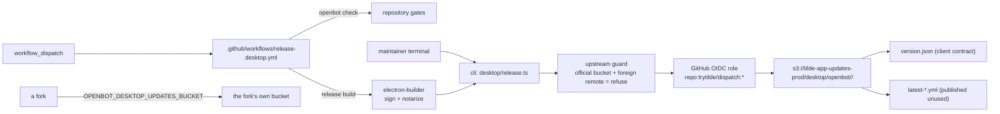

# Intent of the change

- Give the desktop client a release. `openbot desktop package` made a local unsigned build and stopped; nothing published, nothing signed, nothing a user could install without Gatekeeper refusing it.
- Publish an update feed clients can read, so a later in-app banner is a client change rather than a new pipeline.
- Keep publication upstream-only the way ADR-0027 kept store publication upstream-only: the refusal is code, because a fork inherits every tracked file.
- Name the desktop identity for its publisher, before a first signed release makes the identifier permanent.

# Architecture changes

- ADR-0028 records desktop publication. Artifacts go to the existing shared `tilde-app-updates-prod` bucket under a nested `desktop/openbot/<channel>/` prefix. No new bucket: the bucket already grants public read to `desktop/*` and already has a 90-day non-current lifecycle rule, so the nested prefix inherits both. Tilde's own Electrobun feed at `desktop/stable-*` is untouched.
- `openbot desktop release build|publish|manifest|status` is the only publication path, mirroring `openbot mobile release`. `publish` and `manifest` require `--yes` because both change a public feed; `build` and `status` do not.
- The guard refuses when the resolved bucket is the official one and `origin` is not `trytilde/dispatch`, reusing `isUpstreamRepository` from ADR-0027. A GitHub OIDC role scoped to `repo:trytilde/dispatch:*`, added in identity-terraform, is the backstop rather than the only fence.
- `version.json` is keyed by platform (`darwin-arm64`, `linux-x64`). Each entry carries its own version, `signed`/`notarized`, and artifacts with size and base64 sha512. A mac-only release reports honestly instead of claiming linux moved. `manifest` rebuilds it from the `release-<platform>.json` entries already in the bucket, so it converges and a one-platform re-run does not erase the other.
- electron-builder emits `latest-mac.yml` and `latest-linux.yml` through a `generic` publish provider. Nothing reads them; they are published so adopting electron-updater later needs no re-release.
- macOS signs with a Developer ID Application certificate and notarizes through notarytool under the hardened runtime with Electron's JIT entitlements. Missing credentials produce an unsigned build with a warning rather than a failure, recorded as `signed: false` in the manifest.
- The Electron `appId` moves from `dev.openbot.desktop` to `ai.trytilde.openbot` and resolves from the same `OPENBOT_APP_ID` that `apps/mobile/app.config.ts` reads, so one variable renames both clients. It is applied as an electron-builder command-line override: `${env.*}` macros do not interpolate in `appId`, and pnpm forwards a `--` separator to the script verbatim instead of consuming it, so anything after it is dropped.
- The empty-string override bug is the reason `cli/src/environment-overrides.ts` exists. GitHub substitutes `""` for an unset `vars.*`, and `??` accepts it. In ADR-0027's mobile guard that made the official EAS project compare unequal to itself, so the fork refusal never fired.

# Summarized package changes

- `cli` — `commands/desktop/release.ts` (new) with `build|publish|manifest|status`, the upstream guard, an injectable `ObjectStore` backed by the AWS CLI, signing resolution, and the pure manifest merge; `commands/desktop/release.test.ts` (new, 15 tests); `environment-overrides.ts` (new) and its tests; `commands/desktop/index.ts` registers the subcommand; `commands/mobile/release.ts` reads its guard through the new helper; `README.md` documents the command surface.
- `apps/desktop` — `build/entitlements.mac.plist` (new); `package.json` gains `release:mac`/`release:linux`, hardened runtime and entitlements, a `generic` publish provider, and `appId: ai.trytilde.openbot`; `scripts/package-current.mjs` supplies the feed URL and honours an appId override; all five packaging scripts switch to the dependency-aware `--filter "@tryopenbot/web..."`.
- `apps/mobile` — `app.config.ts` reads every override through a helper that treats empty and whitespace as unset.
- `.github/workflows` — `release-desktop.yml` (new): dispatch-only, a plan job that runs the gates and resolves the matrix, macOS arm64 and Linux x64 build/publish jobs, and a manifest job.
- `docs` — ADR-0028 (new); ADR-0027 gains one `Updates` bullet; `CONTRIBUTING.md` gains a desktop-publication prerequisites row and a publishing section with the required repository variables and secrets.
- 2 changesets.

# Critical to apply to forks

yes

**Desktop bundle identifier changed: `dev.openbot.desktop` → `ai.trytilde.openbot`.** A fork that had installed its own desktop build under the old identifier gets a separate app, not an upgrade. macOS also treats it as a different app for keychain and permissions. A fork publishing its own desktop build should set `OPENBOT_APP_ID` rather than inherit either value; the same variable renames the Expo client, so setting it once covers both.

**Desktop publication is upstream-only and needs no setup.** `openbot init` does not ask about it. A fork that wants to publish its own builds sets `OPENBOT_DESKTOP_UPDATES_BUCKET`, and optionally `OPENBOT_DESKTOP_UPDATES_PREFIX` and `OPENBOT_DESKTOP_UPDATES_BASE_URL`; without them `openbot desktop release` refuses and names the override. A fork also needs its own AWS role, because the upstream OIDC role trusts only `repo:trytilde/dispatch:*`.

**An empty environment override no longer silently wins.** If a fork set `OPENBOT_EAS_PROJECT_ID`, `OPENBOT_APP_ID`, or any other override to an empty value — including through an unset GitHub Actions repository variable — it previously overrode the default with an empty string. It now falls through to the default. A fork relying on the old behaviour to blank a value must set a real value instead.

**New external requirements, publication only.** The AWS CLI for `openbot desktop release publish|manifest|status`, a Developer ID Application certificate and an App Store Connect API key for a signed macOS build. None are needed to build, package, or develop. Without the Apple credentials the build still succeeds and produces unsigned artifacts that Gatekeeper refuses; the manifest records `signed: false`.

**Desktop packaging was broken and is now fixed.** `vp run --filter <pkg>` does not build the filtered package's workspace dependencies, so `packages/ui` had no `dist/` and `apps/web` could not resolve `@tryopenbot/ui/openbot-ui.css`. This affected `package`, `package:mac`, and `package:linux` before this change. A fork carrying its own packaging scripts should apply the same `--filter "@tryopenbot/web..."` form.

Run `pnpm install`, `pnpm check`, `pnpm build`, `pnpm test`.
