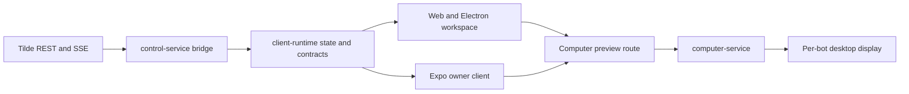

# Intent of the change

- Complete the owner workspace across web, Electron, and Expo instead of treating mobile parity as
  an isolated surface.
- Match the reference bot picker and workspace shell design while keeping OpenBot's single-bot
  conversation model: owner-facing copy says bot, the add-bot palette lists every bot, and no
  cross-bot Computer monitor strip remains.
- Persist public workspace connections, make the Tilde turn queue authoritative, preserve late
  reply ordering, and keep attachment and Computer interactions coherent across clients.
- Improve local development shutdown, environment loading, agent reconciliation diagnostics, and
  Computer preview observability without weakening provider or credential boundaries.

# Architecture changes

- `packages/client-runtime` owns the persisted public workspace registry, active-workspace
  selection, queue reconciliation, optimistic queue mutations, and causally ordered late replies.
  Credentials remain installation-scoped in browser cookies or native secure storage.
- Tilde remains authoritative for agents, sessions, messages, attachments, and queued turns. The
  control service remains the only browser-facing ChatKit bridge and now carries request IDs through
  Computer preview and chat diagnostics.
- The Computer provider image owns the Openbox/noVNC desktop session, browser and file-manager
  launchers, wallpaper, and per-agent virtual display routing. Trusted development seeds can retain
  symlinks; ordinary agent isolation rules are unchanged.
- The CLI owns graceful child-process shutdown, expected signal exit classification, configuration
  environment loading, and development lifecycle rebuild behavior.
- Expo keeps native PKCE, SecureStore, file picking, gestures, fonts, and guarded WebView take-over,
  while consuming the same client-runtime contracts and queue actions as web and Electron.

# Summarized package changes

- `apps/web`, `packages/ui`, and `packages/client-runtime`
  - Add persisted workspace selection, loopback development workspace seeding, loading and access
    states, and shared public contracts.
  - Rebuild the sidebar, command-palette bot picker, settings route, composer, queue, transcript,
    rich message, avatar, resize, and responsive layout behavior.
  - Keep every bot in the add-bot list, put Create a new bot first, use Search bots, remove agent-only
    headings and separators, and remove group-chat-style Computer switching.
  - Make queued turns optimistic and authoritative, steer/reorder/remove through shared runtime
    actions, and order late replies by causal reply IDs.
- `apps/mobile`
  - Retain the existing PR's native onboarding, chat navigation, assistant-ui presentation, rich
    attachments, prompt queue, and guarded Computer take-over while adopting the shared steering
    action and workspace discovery behavior.
- `apps/desktop`
  - Discover native OIDC configuration from the control service, keep the renderer bridge narrow,
    package the required runtime assets, and place macOS settings navigation below window controls.
- `apps/control-service` and `apps/computer-service`
  - Add bot creation execution, queue policy reconciliation, Computer preview request tracing, and
    virtual desktop lifecycle diagnostics.
- `packages/computer-service-provider` and `packages/computer-tools`
  - Build the Openbox/noVNC desktop image and launchers, preserve trusted-development symlinks, and
    add attachment transfer helpers with focused tests and public API documentation.
- `packages/agent-provider` and `packages/agent-service-provider`
  - Reconcile queue policy and improve development workspace deployment and diagnostics.
- `cli`
  - Treat expected interrupt exits as healthy shutdown, terminate child processes cleanly, load
    tracked and local environment layers predictably, and avoid noisy recursive-run failures.
- `CONTEXT.md`, ADR-0017, package READMEs, tests, and Changesets
  - Record Bot as owner-facing language and Tilde Agent as the runtime resource, document the shared
    runtime and provider contracts, cover the combined behavior, and publish fixed-group release
    notes.

# Critical to apply to forks

yes

Forks must install the updated lockfile, rebuild web and native clients, and preserve the new
`client-runtime` workspace and queue contracts. Custom clients must keep credentials scoped to each
installation, use the Tilde queue as the authoritative owner-message path, and reconcile late
replies by causal identity. Forks with custom Computer images must incorporate the new desktop
session assets and per-agent display routing. Fork-owned `configuration/` remains excluded from this
upstream change; only the canonical `configuration/.gitignore` sentinel is present. Validate with
`pnpm check`, `pnpm build`, `CI=1 pnpm test:e2e`, focused provider/runtime/desktop tests, and the
platform package or device flow used by the fork.
