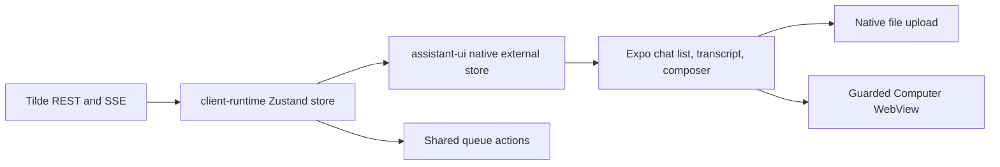

# Intent of the change

- Mobile owner client catches desktop workspace capability.
- First launch shows desktop-shaped onboarding. Later launch shows workspace picker.
- Chat list fills screen. Chat opens full screen. Left swipe returns.
- Rich messages, native attachments, prompt queue, live Computer preview, take-over ship.
- Desktop look stays same. One colliding attachment selector renamed. No visual change.

# Architecture changes

- Tilde still chat authority. Sessions, messages, attachments, queued turns stay there.
- `client-runtime` still one state authority. New queue text helper and queue mutation actions shared.
- assistant-ui native sits above external OpenBot store. Transcript/composer behavior only. No Assistant Cloud state.
- Expo owns PKCE, SecureStore, picker, upload bytes, gesture, font, WebView.
- Computer route unchanged. Bearer token only on authenticated preview request.

# Summarized package changes

- `apps/mobile`
  - Add animated native agent avatar system, Inter type family, desktop-parity onboarding frames.
  - Add explicit workspace-first boot after onboarding, native chat-list navigation, left-swipe back.
  - Add assistant-ui native transcript and composer over external OpenBot messages.
  - Add rich file, image, video, audio, reasoning, and tool rendering.
  - Add document picker, SHA-256 upload, upload progress, signed attachment resolution.
  - Add prompt queue reorder, edit, run-now, remove controls.
  - Add authenticated Computer preview shield, take-over, release, retry.
  - Add focused assistant message and gesture tests. Update package README.
  - Signed iOS `preview` build completed in EAS from PR head. No App Store submission.
- `packages/client-runtime`
  - Add exported `queuedTurnText`.
  - Add `runQueuedTurnNow`, `reorderQueuedTurn`, `removeQueuedTurn` runtime actions.
  - Permit onboarding completion without fake agent preferences.
  - Add queue action, queue text, onboarding tests. Update public API README.
- `apps/web`
  - Consume shared queue text and queue mutation actions. Behavior stays same.
- `packages/ui`
  - Rename `file-icon` selector to `attachment-glyph`. Styling stays same.
- `docs/adrs/0017-shared-client-runtime-and-expo-mobile.md`
  - Record expanded mobile boundary and assistant-ui native presentation choice.
- `.changeset/mobile-owner-parity.md`
  - Fixed-group minor release note.

# Critical to apply to forks

yes — mobile dependencies and public runtime actions change. Fork must install the new lockfile,
rebuild its native development client, and re-export both mobile platforms. A fork with custom Expo
chat markup must either adopt the assistant-ui external-store wrapper or preserve the same
`client-runtime` authority and queue behavior. A fork with custom first-run state must reconcile the
shared onboarding record before shipping, or existing users can see onboarding again. A fork that
customizes Computer preview must preserve bearer authentication, preview shielding, and explicit
take-over. Run `pnpm check`, `pnpm build`, `CI=1 pnpm test:e2e`, mobile tests/typecheck, and a real
Android or iOS device flow.
