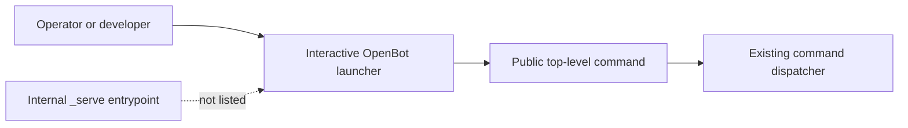

# Intent of the change

- Show every public top-level `openbot` command in the interactive launcher.
- Restore discoverability for mobile, desktop, deployment, test, remote-development, environment,
  secret, and background lifecycle workflows.
- Keep `_serve` hidden because it is an internal watched-process entrypoint, not an operator or
  developer command.
- Prevent the launcher from silently dropping the current public command set again.

# Architecture changes

- No architecture boundary changes.
- ADR-0018 remains the governing decision: one published `openbot` CLI owns operator and developer
  workflows.
- `cli/src/ui.tsx` remains the terminal presentation owner. Command execution remains in
  `cli/src/commands/`; provider, client, configuration, and deployment ownership are unchanged.

# Summarized package changes

- `openbot`
  - Add `orchestrate`, `deploy`, `secrets`, `env`, `test`, `e2e`, `desktop`, `mobile`, `connect`, and
    `remote` to the interactive launcher beside the commands already shown.
  - Retain `init`, `dev`, `new-agent`, `check`, `build`, and `help`.
  - Add an Ink renderer regression test asserting that all 16 public top-level commands appear.
  - Add a patch Changeset for the owner-visible CLI fix.
- Validation
  - Full CLI suite: 124 tests passed.
  - Repository check and build gates passed.
  - The built `cli/dist/index.js` launcher was exercised directly and rendered the complete menu.

# Critical to apply to forks

no

No configuration, secret, state, protocol, dependency, deployment, or provider migration is
required. Existing commands remain callable exactly as before; this change only makes all public
top-level commands visible in the interactive launcher. Forks that want the corrected discovery
surface should merge the update, install their normal locked dependencies, rebuild `openbot`, and
run `pnpm --filter openbot test`.
