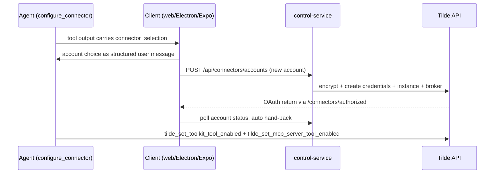

# Intent of the change

- Bot configure own connectors from chat. Agent tool `configure_connector` show account picker
  card; user pick account or add new one; agent enable and map provider tools on its own MCP
  server through team-scoped Tilde control plane.
- Credentials never in chat. New-account forms post to owner-auth `/api/connectors/*`; control
  service encrypt and create against Tilde; brokered OAuth return on public
  `/connectors/authorized`; clients poll account status and hand back to agent automatically;
  desktop and mobile bounce through `openbot://` deep link.
- Same capability on web, Electron, and Expo. Contracts and schema-to-form logic in
  `client-runtime`; presentation per client.
- Fix reconciler gaps found by live testing: control-plane functions were never mapped onto agent
  MCP servers; Tilde skill names are team-unique; catalog list requires `deployment_alias`.
- Modal overlays now URL-routable (`?connector=<provider>`, `?dialog=new-agent`) so redirects and
  deep links reach them and the back button close them.

# Architecture changes

- New runtime utility package `@tryopenbot/connector-tools` for authored agents, sibling of
  `computer-tools`; agents import it directly, no provider abstraction.
- `client-runtime` gains the `contracts/connectors` group: `connector_selection` payload, provider
  and account schemas, `connectorSetupFields`, `connectorAuthorizedReturnUrl`,
  `waitForConnectorAccountActive`, hand-back message builders, and client methods for
  `/api/connectors/*`.
- Control service owns the credential write path (it already holds the team API key) plus the
  public OAuth return page. Chat proxy unchanged; picker payload rides ordinary tool parts.
- Agent provider reconciler now maps every enabled Tilde control-plane function onto each agent's
  runtime MCP server and namespaces authored skill names as `<agent-id>-<skill-name>`.
- Governing record: ADR-0027.

# Summarized package changes

- `packages/connector-tools` (new)
  - `createConfigureConnectorTool` lists the provider catalog and enabled accounts from Tilde and
    emits the picker payload; tests cover payload shape, name fallback, unknown provider, and
    upstream failure.
- `packages/client-runtime`
  - `contracts/connectors` group and client methods `listConnectorProviders`,
    `listConnectorAccounts`, `createConnectorAccount`; icon metadata (`icon_url`) in provider and
    selection schemas.
- `packages/ui`
  - `ConnectorAccountGrid` (2-column card grid, icon or initials tile, add-account card),
    `ConnectorSetupDialog` (credential-source choice, schema-driven fields, OAuth waiting state),
    transcript routing so completed picker parts render as cards, connector CSS, Storybook
    stories.
- `apps/web`
  - Picker and setup wiring, OAuth polling auto hand-back, Electron detection for the return
    client, URL-routable modals via validated workspace search params, `/connectors` Vite proxy.
- `apps/mobile`
  - Native picker (`chat/connector-picker.tsx`) and credential sheet (`connector-setup.tsx`) with
    the same polling hand-back and mobile return URL.
- `apps/desktop`
  - No code change needed: the existing `openbot://` protocol handler already focuses the window;
    fixed a leaked mock in `auth.test.ts`.
- `apps/control-service`
  - `registerConnectorRoutes`: provider catalog, account listing, account creation with
    server-side encrypt/create/broker, and the public `/connectors/authorized` return page.
- `packages/agent-provider`
  - Map control-plane functions onto each agent's MCP server; namespace skill names per agent;
    send required `deployment_alias` when listing the catalog.
- `cli`
  - Agent templates: `tools/configure_connector.ts`, rewritten `instructions.ts` (connector
    ladder, picker etiquette, enable/map workflow, server id), eight shared `tilde-*` skills,
    scaffold lists and required-template gate, step budget 24.
- Docs: ADR-0027, README updates for the four changed packages, one changeset (minor, fixed
  group).

# Critical to apply to forks

yes

Templates seed once, so existing fork agents do not gain the capability from this merge alone.
For each agent under `configuration/agent` (and every `subagents/<id>`): add
`tools/configure_connector.ts` (render the new template with the agent's env prefix), import and
register `configure_connector` in `agent.ts` local tools, replace `instructions.ts` with the new
template rendering, copy the eight `tilde-*` skills into `skills/`, and raise `stopWhen` to
`stepCountIs(24)`. Also copy the new template files into `configuration/templates/agent/**` so
future agents include them (the scaffold's required-file gate now demands
`tools/configure_connector.ts.hbs`). Run `pnpm install` (new workspace package
`@tryopenbot/connector-tools`), then a dev boot or deployment so the reconciler maps the
control-plane functions onto every agent's MCP server and renames skills to their namespaced
form. Forks with a custom web Vite config must proxy `/connectors` alongside `/api/connectors`.
Validate with `pnpm check`, focused connector package tests, and `CI=1 pnpm test:e2e`.
