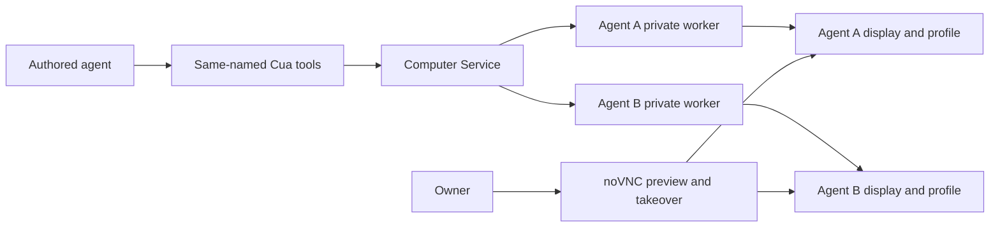

# Intent of the change

- Make Cua Driver the single programmatic GUI backend in every OpenBot Computer.
- Expose the installed Cua runtime catalog to authored agents as individual, identically named local tools.
- Keep noVNC owner-only while preserving the legacy screenshot and input RPCs through Cua.
- Give every agent canonical Cua guidance plus an OpenBot-owned computer-use overlay, with an idempotent path from the bundled fallback to Tilde's managed skill.

# Architecture changes

- Computer Service owns one lazy private Cua worker per validated agent ID and display. Worker startup binds the agent display, home, browser profile, XDG runtime, and D-Bus accessibility session; failures are evicted for retry and shutdown drains all workers.
- `ListCuaTools` and `CallCuaTool` preserve runtime JSON Schemas, ordered text and images, structured and raw JSON, verification, degradation, error codes, action metadata, and explicit completion uncertainty.
- `@tryopenbot/computer-tools` eagerly builds the AI SDK tool set, rejects name collisions, forwards cancellation, and uploads returned images through Tilde's session attachment boundary.
- Agent Provider owns registry reconciliation: the OpenBot overlay is permanent, the trusted managed Cua skill is preferred, and the provenance-recorded snapshot is removed only when the managed skill is available.
- Computer providers keep image provisioning and owner preview, but no longer implement direct GUI input or screenshot paths.

# Summarized package changes

- `apps/computer-service` and `packages/computer-service-proto`
  - Add the typed catalog and call RPCs, supervise private workers, preserve complete result metadata, route compatibility calls through Cua, and maintain per-agent D-Bus accessibility sessions.
- `packages/computer-tools` and `cli`
  - Convert live JSON Schemas into one AI SDK tool per Cua capability, upload image results, reject collisions, and wire the default authored-agent scaffold asynchronously.
- `packages/computer-service-provider`
  - Pin Cua Driver 0.21.0 for amd64 and arm64 with published SHA-256 checksums, install accessibility dependencies, disable telemetry, enable Chromium accessibility, and remove obsolete direct GUI implementations.
- `packages/agent-provider`
  - Reconcile the permanent OpenBot guidance, prefer the trusted managed Cua provider, and bundle a provenance-recorded canonical fallback with migration tests that preserve user-owned skills.
- `docs/adrs/0029-cua-driver-computer-use.md`, package READMEs, provenance notices, and Changeset
  - Record ownership, unrestricted initial permissions, deployment and security consequences, and the managed-skill, policy, demonstration, and mobile follow-ups.

# Critical to apply to forks

yes

Forks must update the lockfile and Computer images so the 0.21.0 SDK and checksum-pinned native driver stay matched. Existing authored agents must adopt the asynchronous Cua tool factory with their fixed IDs, and fork-owned future-agent templates must carry the same wiring. Deployments should reconcile registries so every current and future agent receives the OpenBot computer-use overlay and either the trusted managed Cua skill or the bundled fallback. Rebuild and validate the Computer image on every deployed architecture before rollout; noVNC remains the owner preview path.
