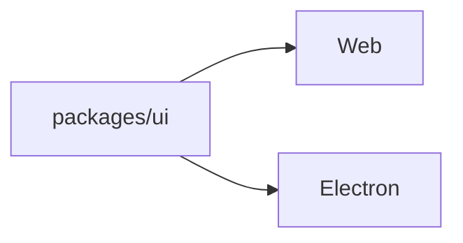

# Intent of the change

Finish the remaining transcript and Electron shell details from the UI fix ledger without retaining the superseded Paper Mono direction.

# Architecture changes

No architecture boundary changes. Web and Electron continue to share `packages/ui`.

# Summarized package changes

- `@tryopenbot/ui`: loading skeleton and scroll control stability.
- `@tryopenbot/web`: transcript loading state.
- `@tryopenbot/desktop`: drag-region and interactive control fixes.

# Critical to apply to forks

No. Forks may take the patch normally; Paper Mono assets should not be carried forward.

<FOLLOW UP>
Owner: apps/mobile
Trigger: when the Expo transcript loading state is aligned with the shared owner-chat experience
Work: render native chat-message skeletons while retaining the native prompt and show load failures above it
</FOLLOW UP>

