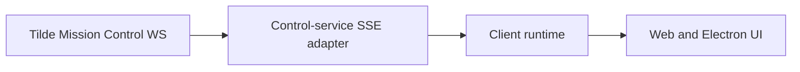

# Intent of the change

Keep background agent activity converged and make owner-created bot setup durable across navigation, reload, and dynamic agent endpoint discovery.

# Architecture changes

ADR-0014 now records the fixed, server-only Mission Control WebSocket to SSE adapter and its replacement boundary. Shared client-runtime contracts own background and setup state.

# Summarized package changes

- `@tryopenbot/control-service`: background stream and durable setup routes.
- `@tryopenbot/client-runtime`: resumable setup and sidebar reconciliation.
- `openbot` and `@tryopenbot/agent-service-provider`: focused reconciliation and late endpoint loading.
- `@tryopenbot/ui` and `@tryopenbot/web`: setup, busy, unread, and loading presentation.

# Critical to apply to forks

Yes. Forks using background activity require the Tilde Mission Control endpoint, and trusted development Computers must expose the existing new-agent CLI workflow.

<FOLLOW UP>
Owner: Tilde API and OpenBot control-service maintainers
Trigger: before the Mission Control endpoint or event schema changes, or when its public contract is available
Work: publish and version the WebSocket path, authentication, heartbeat, and event schema in Tilde documentation/OpenAPI; add a compatibility contract test; migrate OpenBot to the documented contract if it differs
</FOLLOW UP>

<FOLLOW UP>
Owner: apps/mobile
Trigger: when mobile exposes owner-created bot setup
Work: render the shared agent-setup state with native components and preserve resume, failure, and final selection behavior without importing packages/ui
</FOLLOW UP>

