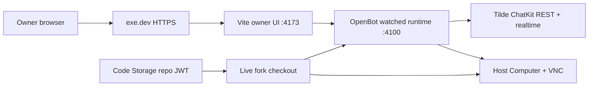

# Intent of the change

- Synchronize `trytilde/our-openbot` with current upstream OpenBot while preserving fork-owned
  configuration and agents.
- Run the complete owner/runtime/Computer stack continuously on one persistent 2-vCPU/8-GB
  exe.dev VM in watched development mode.
- Use Code Storage as managed Git infrastructure while retaining only a repository-scoped Git
  credential after setup.
- Make the exact public exe.dev HTTPS origin work through OIDC, unsafe-request validation, and the
  consolidated ChatKit realtime route.
- Adopt the current upstream ChatKit runtime, SDK contracts, standalone avatar export, and package
  build fixes needed by the fork.

The intended result is a single inexpensive production-shaped development host that can be opened
from a normal browser, invokes the existing Tilde-owned agents, exposes the host Computer through
the normal capability boundary, and remains continuously deployable from the fork.

# Architecture changes

- ADR-0032 records the deliberate single trust and failure domain: Vite, control service, authored
  agents, computer-service, browser/VNC processes, source checkout, and decrypted runtime
  configuration share one persistent exe.dev VM.
- `ExeDevPlatform`, `ExeDevRuntimeServiceProvider`, and `ExeDevComputerProvider` share one concrete
  VM connection. The production lifecycle publishes Vite through exe.dev HTTPS, fast-forwards the
  Code Storage checkout, installs dependencies, and supervises `pnpm dev` with a lingering systemd
  user service.
- `CodeStorageGitProvider` uses the official `@pierre/storage` SDK. The organization signing key is
  transient setup input; the retained JWT is scoped to one repository with Git read/write and no
  force push.
- The Browser remains same-origin with OpenBot. OIDC callbacks and unsafe mutation checks use the
  configured public HTTPS origin rather than the HTTP scheme seen behind exe.dev's proxy. Wildcard
  origins are not accepted.
- OpenBot forwards its selected Tilde organization in `x-tilde-org-id` when registering the OIDC
  client. The owner chat client uses the consolidated workspace and realtime routes from current
  upstream.
- Production Tilde routes separately accept short-lived ChatKit realtime tickets at the upgrade
  handler; generic product billing bootstrap no longer intercepts that exact WebSocket path.

The first production deployment exposed an existing Agent Provider idempotency gap: reconciling an
already-present `ello` inbox returns `already exists`. The documented `--skip-agent-reconcile`
recovery control was used only to refresh the already-provisioned runtime; it did not replace or
duplicate Tilde resources.

# Summarized package changes

- Platform and deployment providers
  - Add exe.dev connection, sizing, public-origin, remote bootstrap, systemd, host Computer, VNC,
    and live-checkout support.
  - Preserve a dirty remote checkout; fast-forward a clean checkout only.
  - Add an explicit agent-reconciliation recovery control for external provisioning failures.
- Git and initialization
  - Add Code Storage as a first-class hosted Git provider using `@pierre/storage`.
  - Keep organization key material transient and persist only a repository-scoped Git JWT.
  - Support GitHub synchronization configured at Code Storage and tracked fork configuration.
- Authentication and control service
  - Register the exact exe.dev callback/origin and forward the selected Tilde organization.
  - Preserve HTTPS callback construction behind the remote development proxy.
  - Move owner chat to the consolidated workspace/realtime routes and current ticket protocol.
- Client, SDK, and UI upstream synchronization
  - Adopt current ChatKit identity, session scope, history, realtime reconciliation, and MCP SDK
    surfaces.
  - Adopt the supported standalone OpenBot avatar package export and Git-package build artifacts.
  - Refresh generated Tilde API contracts from the upstream source change.
- Validation and deployment evidence
  - Frozen dependency installation passed.
  - Auth Provider passed 6 tests; Control Service passed 65; Client Runtime passed 84.
  - `pnpm check` passed with zero errors; `pnpm build` passed.
  - The official production dry-run completed and the deployment fast-forwarded the VM to commit
    `488a717`; the systemd service is active and local/public health is HTTP 200.
  - The current socket-ticket path reaches authentication rather than returning 404 or failing
    origin validation. Twelve consecutive production WebSocket probes reached the dedicated
    realtime ticket validator instead of generic billing authentication.

Available evidence from the current deployment task, its cooperating agent reports, the full PR
diff and history, prior update records, and GitHub discussion was reviewed. The complete archived
local coding-agent thread database was not exposed through a supported thread API in this session,
so unrelated archived threads were not re-opened and are not claimed as reviewed.

# Critical to apply to forks

yes

Forks adopting this update must choose the topology intentionally:

1. Merge the upstream synchronization while preserving fork-owned `configuration/` and encrypted
   secrets. No state import/export is required.
2. Configure the Code Storage GitHub App before creating a private synchronized repository, then
   provide the organization API signing key only during setup. Confirm it is not persisted.
3. Retain only the repository-scoped read/write JWT and keep it out of client code and tracked
   plaintext files.
4. Configure one shared `ExeDevPlatform` for the runtime and Computer providers, an exact HTTPS
   public origin, the existing VM name, and the intended checkout path.
5. Run the official production dry-run, then deploy. Verify the remote commit, active systemd
   service, public `/healthz`, authenticated owner login, agent invocation, Computer tool call,
   noVNC, and ChatKit realtime stability.
6. If pre-existing Tilde resources make agent reconciliation fail, use
   `--skip-agent-reconcile` only as a recovery measure after confirming those resources are already
   correct. A future provider fix should make repeated inbox reconciliation converge normally.

Local, Vercel, and Tilde Cloud forks do not need to adopt exe.dev. Any fork that does must accept
that agents and the Computer share the host, source, processes, network, and decrypted runtime
configuration without an inner isolation boundary.
