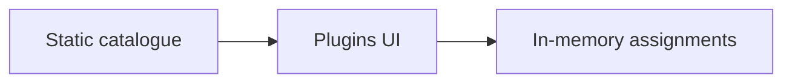

# Intent of the change

Upstream the Plugins information architecture now as an explicit in-memory prototype so provider-backed end-to-end implementation can follow against an exercised surface.

# Architecture changes

No persistence or provider contract is introduced. Static catalogue data and assignments stay inside the presentation prototype.

# Summarized package changes

- `@tryopenbot/ui`: catalogue, filters, assignment interactions, and shared components.
- `@tryopenbot/web`: settings route and navigation.
- E2E: browser proof for tool and skill assignment by bot.

# Critical to apply to forks

No. This prototype does not persist connections or assignments.

<FOLLOW UP>
Owner: agent-provider, client-runtime, control-service, and client maintainers
Trigger: immediately after the Plugins information architecture is accepted and the fork's end-to-end implementation is ready
Work: replace static catalogue data and in-memory assignments with provider-backed discovery, account connection, persisted per-agent assignment, idempotent reconciliation, loading/error/empty states, and cross-client contract plus browser coverage
</FOLLOW UP>

<FOLLOW UP>
Owner: apps/mobile
Trigger: when persisted Plugins contracts are available
Work: build the native catalogue and per-bot assignment surface against client-runtime contracts without importing packages/ui
</FOLLOW UP>

